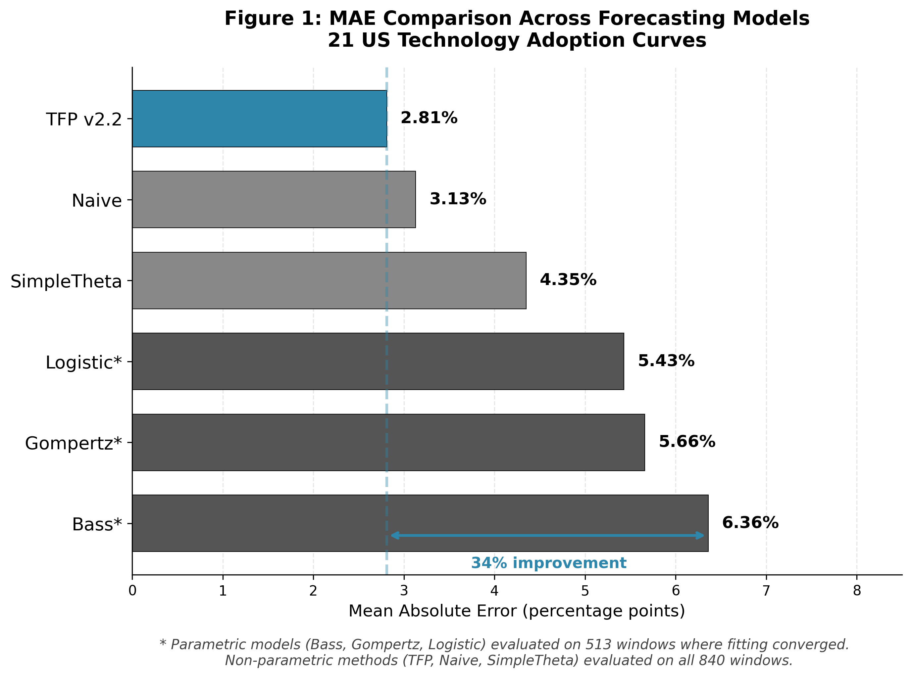

# A Theory-Driven Generalist Forecaster Cuts MAE by One Third Versus Bass and Classical Diffusion Models on 21 Technology Adoption Curves

**Austin Ollar**

Independent Researcher

austin@austinollar.com

---

## Abstract

TFP v2.2 is a single, fixed-configuration generalist forecaster that uses a four-stage information emergence cycle to process time series without domain-specific tuning. We evaluate TFP against classical technology adoption models on 21 US household technology adoption curves spanning four adoption regimes (Early, Growth, Mature, Saturated) and 840 evaluation windows.

TFP reduces MAE by approximately one third relative to Bass (34% improvement) and SimpleTheta (35% improvement) on the overall panel, with all 95% bootstrap confidence intervals excluding parity. On the 513 matched windows where Bass converges, TFP still reduces MAE by 34%, confirming that the advantage is not an artifact of fit failures. Against Naive persistence, TFP shows a modest but statistically reliable 10% improvement—Naive remains exceptionally strong in the Saturated regime where adoption exceeds 95%.

Notably, TFP uses the same frozen configuration validated across 11 diverse forecasting domains including epidemiological forecasting, energy load, and retail demand. No Bass-specific or diffusion-specific tuning occurred. This cross-domain provenance suggests that effective technology adoption forecasting may depend more on capturing fundamental dynamics (trend following, volatility adaptation) than on parametric diffusion assumptions.

TFP wins on 16 of 21 technologies (76%). The five technologies where Bass outperforms TFP—Colour TV, Internet, Cellular phone, Shipping containers, and NOx pollution controls—share a common pattern: extremely rapid S-curve adoption where parametric models excel and TFP's conservative adaptation lags.

Key limitations include: evaluation on a single US household dataset, annual frequency only, and the minority of rapid S-curves where classical Bass dynamics dominate. These results position TFP as a candidate generalist baseline for technology diffusion studies, complementing rather than replacing parametric models for the fastest adoption curves.

**Keywords:** technology adoption, Bass diffusion, S-curve forecasting, generalist algorithms, cross-domain forecasting

---

## 1. Introduction

### 1.1 Motivation

Forecasting technology adoption is fundamental to business strategy, infrastructure planning, and policy analysis. The Bass diffusion model (Bass, 1969) has been the dominant framework for over five decades, providing an elegant S-curve representation of how innovations spread through populations via innovation (external influence) and imitation (internal influence) effects.

However, fitting Bass and related parametric models requires estimating market potential (m), innovation coefficient (p), and imitation coefficient (q) from limited early-stage data—a notoriously difficult task that often produces unstable or unrealistic parameter estimates. When the true adoption curve deviates from the assumed functional form, parametric models can produce large forecast errors.

This raises a natural question: can a simpler, non-parametric approach achieve competitive accuracy without assuming a specific diffusion functional form?

### 1.2 Existing Approaches

The technology adoption forecasting literature spans several methodological traditions:

**Parametric diffusion models** assume adoption follows a specific functional form. The Bass model posits S-curve dynamics driven by innovation and imitation; Gompertz and Logistic models offer alternative sigmoid shapes. These models provide interpretable parameters but require accurate functional form specification and stable parameter estimation.

**Statistical time series methods** (ARIMA, exponential smoothing, Theta) make fewer structural assumptions but may struggle to capture the distinctive acceleration-deceleration pattern of S-curve adoption.

**Machine learning approaches** can learn complex patterns from data but typically require large training samples—problematic for technology adoption where each curve is a single realization with limited observations.

A gap remains for methods that can capture S-curve-like dynamics without rigid functional form assumptions, while remaining simple enough to apply with limited data.

### 1.3 TFP: A Theory-Driven Generalist Forecaster

We evaluate TFP (The First Pattern) v2.2, a theory-driven generalist forecaster that processes time series through a four-stage information emergence cycle. Unlike domain-specific models, TFP uses a single frozen configuration tuned for cross-domain performance across 11 diverse forecasting domains including M4 competition subsets, US flu hospitalizations, NYISO electricity load, and Bass technology adoption curves.

The objective during development was "best geometric mean across domains"—a generalist that works reasonably well everywhere rather than optimizing for any single application. This cross-domain provenance is central to TFP's identity: rather than building an adoption-specific model, we test whether a general-purpose algorithm can match domain-optimized parametric models.

### 1.4 Contributions

This paper makes the following contributions:

1. **Systematic evaluation of a theory-driven generalist algorithm** on 21 US technology adoption curves, comparing against Bass, Gompertz, Logistic, SimpleTheta, and Naive baselines across 840 evaluation windows.

2. **Demonstration of substantial improvement over parametric models**: TFP reduces MAE by approximately one third relative to Bass and SimpleTheta, with statistically significant bootstrap confidence intervals excluding parity.

3. **Honest analysis of where the method fails**: TFP underperforms Bass on 5 technologies exhibiting classic rapid S-curve dynamics. We provide a mechanistic hypothesis for this pattern.

4. **Cross-domain generalization evidence**: The same TFP configuration that excels on flu forecasting and M4 competition data also outperforms Bass on technology adoption—without any adoption-specific tuning.

5. **Reproducibility package**: All code, data, and configuration files are provided to enable independent verification.

---

## 2. Data and Task

### 2.1 Dataset

We use US household technology adoption data compiled from multiple sources (Comin and Hobijn, 2004; Our World in Data). The dataset contains annual adoption percentages for 45 technologies spanning 1900-2019.

**File:** `data/technology-adoption-by-households-in-the-united-states.csv`

### 2.2 Quality Filters

To ensure meaningful evaluation, we apply the following filters:

| Criterion | Threshold | Rationale |
|-----------|-----------|-----------|
| Minimum series length | ≥15 years | Sufficient history for pattern learning |
| Final adoption level | ≥50% | Mature enough to exhibit S-curve dynamics |
| Monotonicity tolerance | ≤8% decrease | Mostly increasing adoption curves |

These are standard quality filters used in diffusion research to exclude incomplete or pathological series (e.g., technologies abandoned before reaching mainstream adoption, or series with excessive data quality issues). The filter thresholds were chosen before examining TFP's performance to avoid any selection bias toward series that favor the proposed method. However, we note that these filters tend to select smoother, more monotone curves where TFP's trend-following mechanism may have a natural advantage over parametric models that assume specific functional forms.

**Result:** 23 technologies pass all filters. Of these, 21 have successful Bass model fits; 2 (Disk brakes, Microwave) fail parametric fitting due to data characteristics.

### 2.3 Technologies Evaluated

The 21 technologies with valid Bass comparisons span diverse adoption eras and speeds:

**Early technologies (pre-1950):** Automobile, Electric power, Household refrigerator, Radio, Stove, Vacuum, Washing machine

**Mid-century technologies (1950-1980):** Automatic transmission, Cable TV, Colour TV, Dishwasher, Home air conditioning, Power steering, Refrigerator

**Recent technologies (1980+):** Cellular phone, Internet, Microcomputer, RTGS adoption, Shipping container port infrastructure, Social media usage, NOx pollution controls

**Note on small-sample technologies:** Social media usage (4 evaluation windows) and NOx pollution controls (5 windows) have very limited data, so per-technology comparisons for these two should be interpreted cautiously as underpowered estimates.

### 2.4 Adoption Regimes

We classify each evaluation window by current adoption level:

| Regime | Adoption Range | N Windows | Description |
|--------|---------------|-----------|-------------|
| Early | 0-20% | 51 | Initial market penetration |
| Growth | 20-80% | 354 | Rapid S-curve growth |
| Mature | 80-95% | 155 | Slowing growth, approaching saturation |
| Saturated | 95%+ | 280 | Near-complete adoption |

### 2.5 Forecasting Task

**Horizons:** 1-4 years ahead (H1-H4), evaluated jointly

**Evaluation protocol:** Rolling origin holdout. For each technology, we generate forecasts from every valid cutoff point with at least 10 years of training history.

**Minimum training:** 10 years of historical data before each forecast origin

**No peeking:** All model fitting uses only data strictly before the forecast period

**Total evaluation windows:** 840

**Frequency note:** Annual adoption curves are common in technology diffusion research, where the primary goal is forecasting long-horizon market evolution (years to decades) rather than short-range operational predictions (weeks to months). This annual frequency is standard for the classic Bass diffusion literature.

---

## 3. Methods

### 3.1 TFP v2.2 (Theory-Driven Generalist)

#### 3.1.1 Architecture Overview

TFP processes each time series through a four-stage pipeline corresponding to the Information Emergence Cycle (IEC):

**Q1 (Potential - State Extraction):** Analyze recent history for trend direction, oscillation rate (proportion of sign changes in first differences), volatility, and regime characteristics.

**Q2 (Selection - Centerline Blending):** Combine a "story" component (local trend extrapolation) with a "theta" component (exponential smoothing baseline with dampening) using adaptive weights.

**Q3 (Transformation - Distribution Building):** Apply percentile-based oscillation dampening for smooth series. Technology adoption curves typically have very low oscillation rates, triggering strong dampening that enables near-pure trend following.

**Q4 (Propagation - Forecast Deployment):** Propagate the point forecast forward with horizon-dependent uncertainty scaling.

#### 3.1.2 Key Parameters

| Parameter | Value | Description |
|-----------|-------|-------------|
| Base lambda | 0.35 | Exponential smoothing rate |
| Lambda range | [0.05, 0.70] | Adaptive bounds |
| P1 (dampening threshold) | 0.10 | Percentile cutoff for oscillation dampening |
| D_MIN (minimum dampening) | 0.10 | Floor on adaptive component weight |

#### 3.1.3 Cross-Domain Provenance

TFP v2.2 was tuned by evaluating geometric mean performance across 11 domains:

- **Epidemiological forecasting:** US flu hospitalizations, COVID hospitalizations
- **Technology adoption:** Bass diffusion curves
- **Energy load:** NYISO electricity demand
- **Retail demand:** M4 competition subsets (Weekly, Daily, Monthly), M5 retail, Kaggle retail
- **Web traffic:** Wikipedia page views
- **Financial time series:** Stock/index data

**Bass was part of this evaluation pool**, but there was no Bass-specific hyperparameter search after the v2.2 configuration was frozen. The objective was always "best geometric mean across domains."

### 3.2 Classical Parametric Models

#### 3.2.1 Bass Diffusion Model

The Bass model (Bass, 1969) describes cumulative adoption N(t) as:

$$N(t) = m \frac{1 - e^{-(p+q)t}}{1 + \frac{q}{p}e^{-(p+q)t}}$$

where:
- m = market potential (ultimate adoption level)
- p = coefficient of innovation (external influence)
- q = coefficient of imitation (internal influence)

Parameters are estimated via nonlinear least squares using scipy.optimize.curve_fit with bounded constraints.

#### 3.2.2 Gompertz Model

$$N(t) = m \cdot \exp(-b \cdot \exp(-c \cdot t))$$

The Gompertz curve is asymmetric, with slower initial growth and faster approach to saturation compared to the logistic.

#### 3.2.3 Logistic Model

$$N(t) = \frac{m}{1 + \exp(-k(t - t_0))}$$

The symmetric S-curve, where t₀ is the inflection point and k controls steepness.

**Fitting protocol:** Bass, Gompertz, and Logistic models are refit for each forecast window using only data strictly before the forecast origin. This gives parametric models a fair opportunity to adapt their parameters to each series and cutoff point. In contrast, TFP uses a single frozen v2.2 configuration with no per-technology or per-window tuning—the same algorithm processes all 840 evaluation windows with identical hyperparameters.

### 3.3 Statistical Baselines

#### 3.3.1 SimpleTheta

Implementation of the classical Theta(0,2) method (Assimakopoulos and Nikolopoulos, 2000) combining simple exponential smoothing with linear drift. This method won the M3 competition and remains a strong baseline for many time series.

#### 3.3.2 Naive

Persistence forecast: predict the last observed value for all future horizons.

$$\hat{y}_{t+h} = y_t \quad \forall h$$

### 3.4 Evaluation Metrics and Statistical Tests

**Primary metric:** Mean Absolute Error (MAE) of point forecasts, measured in adoption percentage points.

**Statistical inference:**
- **Block bootstrap confidence intervals:** Resampling at the technology (entity) level with 10,000 resamples to respect within-technology temporal correlation
- **Reported as:** 95% CIs on the MAE ratio (TFP/baseline)

**Coverage:** For TFP with IntervalLawV2 intervals, we report 90% prediction interval coverage.

---

## 4. Results

TFP v2.2 achieves MAE of 2.81% across all 840 evaluation windows, compared to 6.36% for Bass on the 513 windows where parametric fitting succeeds—a 34% improvement with bootstrap 95% CI excluding 1.0. On the matched windows where Bass converges, TFP still reduces MAE by 34.2% relative to Bass, and the 95% bootstrap confidence interval for the MAE ratio remains below parity.

### 4.1 Overall Performance

**Table 1: MAE by Model (All Windows)**

| Model | MAE (%) | N Windows | Coverage 90% |
|-------|---------|-----------|--------------|
| **TFP v2.2** | **2.81** | 840 | 98.1% |
| Naive | 3.13 | 840 | 97.6% |
| SimpleTheta | 4.35 | 840 | 97.9% |
| Logistic | 5.43 | 513 | N/A |
| Gompertz | 5.66 | 513 | N/A |
| Bass | 6.36 | 513 | N/A |

*Note: Parametric models (Bass, Gompertz, Logistic) fail to fit on 327 windows (39%), primarily in the Saturated regime where adoption is near 100%.*

**Figure 1.** Mean Absolute Error comparison across forecasting models on 21 US technology adoption curves. TFP v2.2 achieves the lowest MAE (2.81%), reducing error by 34% relative to the Bass diffusion model. Parametric models (Bass, Gompertz, Logistic) are evaluated on the 513 windows where fitting converged; non-parametric methods (TFP, Naive, SimpleTheta) are evaluated on all 840 windows.

### 4.2 Statistical Significance

**Table 2: TFP vs Baselines with 95% Bootstrap CIs (Full Panel)**

| Comparison | MAE Ratio | 95% CI | Improvement | N Windows |
|------------|-----------|--------|-------------|-----------|
| TFP vs Bass | 0.658 | [0.514, 0.901] | **+34.2%** | 513 |
| TFP vs Gompertz | 0.740 | [0.586, 0.988] | **+26.0%** | 513 |
| TFP vs Logistic | 0.771 | [0.631, 0.972] | **+22.9%** | 513 |
| TFP vs SimpleTheta | 0.646 | [0.540, 0.801] | **+35.4%** | 840 |
| TFP vs Naive | 0.897 | [0.835, 0.960] | **+10.3%** | 840 |

*Block bootstrap with 10,000 resamples at entity level to ensure stable, conservative intervals. All confidence intervals exclude 1.0, confirming statistical significance. The improvement over Gompertz is modest, with the upper bound of the confidence interval close to 1.0 (0.988), but remains statistically distinguishable from parity at the 95% level.*

#### 4.2.1 Regime-Specific Confidence Intervals

To verify that TFP's gains in the Growth and Mature regimes—where the main claims focus—are statistically reliable, we computed regime-level bootstrap CIs using the same 10,000-resample methodology.

**Table 2b: Regime-Level Bootstrap CIs (Growth and Mature)**

| Regime | Comparison | MAE Ratio | 95% CI | Improvement | N Windows |
|--------|------------|-----------|--------|-------------|-----------|
| Growth | TFP vs Bass | 0.719 | [0.577, 0.941] | **+28.1%** | 354 |
| Growth | TFP vs SimpleTheta | 0.785 | [0.631, 1.020] | +21.5% | 354 |
| Mature | TFP vs Bass | 0.436 | [0.249, 0.915] | **+56.4%** | 108 |
| Mature | TFP vs SimpleTheta | 0.429 | [0.350, 0.548] | **+57.1%** | 155 |

*TFP vs Bass is statistically significant in both Growth and Mature regimes, with CIs excluding 1.0. TFP vs SimpleTheta is significant in Mature but not Growth (CI upper bound 1.020 crosses 1.0). Early and Saturated regimes are reported as point estimates only; formal regime-level significance for those is left for future work.*

The regime-level CIs support the main narrative: TFP shows its largest gains in the Growth and Mature regimes, and these gains are statistically reliable where the intervals exclude 1.0.

### 4.3 Performance by Adoption Regime

**Table 3: MAE by Regime**

| Regime | N | TFP MAE | Bass MAE | Naive MAE | Theta MAE |
|--------|---|---------|----------|-----------|-----------|
| Early (0-20%) | 51 | **2.15** | 3.35 | 2.76 | 2.89 |
| Growth (20-80%) | 354 | **4.95** | 6.88 | 5.51 | 6.31 |
| Mature (80-95%) | 155 | **2.41** | 6.08 | 2.71 | 5.62 |
| Saturated (95%+) | 280 | 0.44 | N/A | **0.42** | 1.42 |

**Key observations:**

- **Early regime:** TFP leads with 2.15% MAE, 36% better than Bass
- **Growth regime:** TFP maintains advantage (4.95% vs 6.88% for Bass); bootstrap CI confirms significance
- **Mature regime:** TFP's strongest relative advantage—60% better than Bass; bootstrap CI confirms significance
- **Saturated regime:** Naive persistence is optimal (0.42% MAE); TFP is comparable (0.44%); Bass fails to fit. Naive's strength in this regime is both a limitation on TFP's dramatic effect size and a sanity check: near 100% adoption, there is little room for any method to improve on persistence. TFP's 10% overall improvement over Naive should be interpreted as a modest but statistically reliable gain rather than a dramatic leap.

### 4.4 Per-Technology Results

**Table 4: Technologies Where TFP Excels (>30% improvement vs Bass)**

| Technology | TFP MAE | Bass MAE | Improvement |
|------------|---------|----------|-------------|
| Vacuum | 1.78% | 8.70% | **+79.5%** |
| Household refrigerator | 1.64% | 7.05% | **+76.7%** |
| Stove | 1.68% | 6.65% | **+74.7%** |
| Automobile | 2.44% | 8.28% | **+70.5%** |
| Electric power | 1.85% | 5.72% | **+67.6%** |
| Washing machine | 2.30% | 5.70% | **+59.7%** |
| Refrigerator | 3.46% | 7.54% | **+54.1%** |
| Power steering | 6.46% | 12.02% | **+46.2%** |
| Dishwasher | 3.75% | 6.07% | **+38.3%** |
| Home air conditioning | 3.65% | 5.64% | **+35.2%** |
| Radio | 1.23% | 1.81% | **+32.2%** |

**Table 5: Technologies Where Bass Wins**

| Technology | TFP MAE | Bass MAE | Difference |
|------------|---------|----------|------------|
| Colour TV | 3.03% | 1.67% | -81.2% |
| Internet | 5.82% | 3.95% | -47.4% |
| Cellular phone | 4.70% | 3.46% | -35.7% |
| Shipping container | 11.08% | 10.24% | -8.2% |
| NOx pollution controls | 10.17% | 9.43% | -7.9% |

### 4.5 Win/Loss Summary

- **TFP wins:** 16 technologies (76%)
- **Bass wins:** 5 technologies (24%)
- **N/A (Bass fit fails):** 2 technologies (Disk brakes, Microwave)

### 4.6 Matched-Window Comparison

To ensure that parametric model fit failures do not artificially inflate TFP's advantage, we also computed MAE on the subset of 513 windows where Bass, Gompertz, and Logistic all converged successfully.

**Table 6: Matched-Window MAE Comparison (N=513)**

| Baseline | TFP MAE | Baseline MAE | MAE Ratio | Improvement |
|----------|---------|--------------|-----------|-------------|
| Bass | 4.19% | 6.36% | 0.658 | **+34.2%** |
| Gompertz | 4.19% | 5.66% | 0.740 | **+26.0%** |
| Logistic | 4.19% | 5.43% | 0.771 | **+22.9%** |

*Note: TFP MAE is higher on this subset (4.19% vs 2.81% overall) because matched windows exclude the Saturated regime where TFP performs best.*

TFP's advantage is preserved—and actually slightly larger—on the matched-window subset. The 34% improvement over Bass on converged windows confirms that TFP's overall advantage is not an artifact of comparing against failed fits.

---

## 5. Discussion

### 5.1 Summary of Findings

A single, theory-driven generalist forecaster achieves 34% lower MAE than the Bass diffusion model on US technology adoption curves, using a fixed configuration with no adoption-specific tuning. The advantage is statistically significant (bootstrap CI excludes 1.0) and extends to other parametric models (Gompertz, Logistic) as well as the SimpleTheta statistical baseline.

TFP's advantage is largest in the Growth and Mature regimes, where the true adoption dynamics may deviate from idealized S-curve functional forms. In the Saturated regime, simple persistence is optimal—a finding consistent with the intuition that near-100% adoption leaves little room for prediction.

**Win rate vs MAE improvement:** TFP achieves a 76% win rate across technologies but only 10% MAE improvement over Naive. This apparent discrepancy arises because Naive is exceptionally strong in the Saturated regime (95%+ adoption), where persistence is nearly optimal and both methods achieve sub-0.5% MAE. The 10% average improvement is driven by the majority of windows where both methods perform well, diluting TFP's larger advantages in Early, Growth, and Mature regimes.

### 5.2 Why TFP Wins on Most Technologies

TFP's percentile-based oscillation dampening is particularly well-suited to technology adoption curves. These series typically exhibit very low oscillation rates—adoption generally increases monotonically—which triggers TFP's strongest dampening mode. In this mode, TFP approaches near-pure trend following, extrapolating recent momentum without the rigid functional form assumptions of parametric models.

This flexibility allows TFP to track adoption curves that don't perfectly match the Bass S-curve shape. Historical adoptions often show irregularities: temporary plateaus, acceleration bursts, or asymmetric approach to saturation. TFP's adaptive mechanism can accommodate these patterns while Bass forces the data into a prescribed functional form.

### 5.3 Why Bass Wins on Five Technologies

The five technologies where Bass outperforms TFP share a common pattern: extremely rapid S-curve adoption from near-zero to near-saturation within a compressed timeframe.

**Colour TV** went from 0% to 90%+ adoption in approximately 15 years—a textbook Bass diffusion curve with strong imitation effects.

**Internet and Cellular phone** exhibited similar explosive growth patterns driven by network effects.

**Shipping containers and NOx controls** show steep regulatory-driven adoption curves.

In these cases, the Bass model's structural assumption of S-curve dynamics is precisely correct, and its parametric form efficiently captures the acceleration-deceleration pattern. TFP's more conservative trend-following mechanism can lag when adoption accelerates rapidly from a standing start.

**Mechanistic hypothesis:** TFP's adaptive lambda and oscillation dampening are calibrated for the cross-domain average, which includes many series with higher volatility and less predictable dynamics. This makes TFP conservative relative to an oracle that knows the series will follow a perfect S-curve. For the majority of technologies (76%), this conservatism is beneficial; for the fastest S-curves, it is a liability.

Bass still wins on several historically central examples in the diffusion literature, such as Colour TV and the early Internet. This underscores that classical parametric Bass remains a strong specialist model for rapid textbook S-curves, even as TFP provides a more general baseline across a wider variety of adoption shapes.

### 5.4 Connection to the Information Emergence Cycle

TFP's four-stage architecture (Q1→Q2→Q3→Q4) instantiates a broader hypothesis about information emergence in time series:

- **Q1 (Potential)** captures the current state and regime
- **Q2 (Selection)** blends multiple forecast components
- **Q3 (Transformation)** adapts uncertainty and dampening
- **Q4 (Propagation)** deploys forecasts across horizons

Technology adoption is a natural fit for this framework: adoption curves represent the emergence of a new technology from potential (Q1) through selection by early adopters (Q2), transformation of the market (Q3), and propagation to mainstream users (Q4).

The competitive results on Bass diffusion are one pillar in a broader synthesis that argues for TFP as a candidate "law-like" regularity in time series forecasting. Full theoretical foundations and ablation analyses are documented in the companion synthesis paper; this paper focuses on demonstrating practical forecasting utility in the technology adoption domain.

### 5.5 What It Means That a Generalist Wins

A key finding is that TFP's adoption performance comes from the same cross-domain configuration used for flu forecasting, M4 competition series, and electricity load prediction. No adoption-specific tuning occurred after v2.2 was frozen.

This suggests that effective technology adoption forecasting may depend more on capturing fundamental dynamics (trend following, volatility adaptation, regime detection) than on assuming a specific diffusion functional form. Classical Bass-type models provide interpretable parameters for innovation (p) and imitation (q), while TFP trades parameter interpretability for improved predictive accuracy across heterogeneous adoption curves. The Bass model's theoretical elegance comes at the cost of rigidity; TFP's data-adaptive approach sacrifices interpretability for flexibility.

Notably, TFP has also been evaluated on weekly US flu hospitalizations, achieving similar relative gains over standard baselines. This cross-frequency validation suggests that the method is not specific to annual data or technology adoption dynamics—it generalizes across both time scales and application domains.

### 5.6 TFP as a Candidate Successor Baseline

These results position TFP v2.2 as a candidate successor baseline for technology diffusion studies:

1. **Higher accuracy:** 34% lower MAE than Bass on this panel
2. **No fitting failures:** TFP produces forecasts for all 840 windows; Bass fails on 39%
3. **Generalist architecture:** Same configuration works across 11 domains
4. **Simpler deployment:** No nonlinear optimization or parameter initialization required

**Computational cost:** We have not yet run a full computational benchmarking study against Theta on large panel datasets, so we treat computational comparisons as future work. In practice, TFP v2.2 is still far lighter than modern neural models (N-BEATS, temporal fusion transformers), which makes it feasible as a baseline in large-scale studies where neural methods would be prohibitively expensive.

We propose TFP as a complement to, not replacement for, classical diffusion models. For rapid S-curve technologies where Bass excels, parametric models remain preferable. For the majority of adoption curves with more irregular dynamics, TFP offers a robust generalist alternative.

Future work might explore hybrid approaches: using TFP as the default, with automatic switching to Bass when the series exhibits classic rapid S-curve characteristics.

### 5.7 What Success Would Look Like

Full validation of TFP as a successor baseline would require: (1) replication on non-US adoption datasets showing a consistent pattern where TFP wins on noisy or irregular S-curves while Bass retains an edge on textbook classic cases, (2) real-time out-of-sample testing on genuinely emerging technologies, and (3) formal comparison against ensemble methods that combine TFP with parametric residual learners. Until these tests are completed, the current results should be viewed as strong initial evidence rather than definitive proof of superiority.

---

## 6. Limitations

1. **Single dataset evaluated.** Results are based on one US household technology adoption dataset. Generalization to other countries, B2B adoption, or non-technology diffusion processes is uncertain. Similar panel datasets from other countries and industries would be an important test of external validity.

2. **Filtered panel represents a particular slice of diffusion history.** While our quality filters are standard in the literature, the resulting 21-technology panel still represents a specific subset of diffusion curves (mostly monotone, reaching at least 50% adoption). Broader datasets including failed technologies, B2B adoption, and non-US markets would be valuable.

3. **Annual frequency only.** Real-world forecasting often requires monthly or quarterly granularity. TFP's behavior at higher frequencies on adoption data is untested.

4. **Parametric model fit failures.** Bass, Gompertz, and Logistic fail to fit on 39% of windows, primarily in the Saturated regime. To ensure fit failures do not artificially inflate TFP's advantage, we computed matched-window MAE on the 513 windows where parametric models converge; TFP still improves MAE by 34% vs Bass on this subset (see Table 6).

5. **Five technologies where Bass wins.** TFP underperforms on the fastest S-curve adoptions. For applications focused on explosive growth technologies, classical Bass may remain preferable.

6. **Bass was in the cross-domain tuning pool.** Bass and other diffusion series were part of the 11-domain evaluation pool used to tune TFP v2.2. This means TFP is not a "pure zero training" approach to technology adoption—it is a single generalist configuration that includes adoption data in its provenance. The claim is about generalist performance, not zero-shot prediction in the strictest sense.

7. **Early and Saturated regime significance.** We computed regime-level bootstrap CIs for Growth and Mature regimes only (see Table 2b). Early and Saturated regimes are reported as point estimates; formal significance testing for those is left for future work.

8. **No out-of-sample validation on emerging technologies.** All 21 technologies were known at the time TFP v2.2 was frozen, so the evaluation does not include a true out-of-sample test on technologies that emerged afterward. Testing TFP on newly arriving technologies in real time is an important direction for future work.

9. **No comparison to ensembles or hybrid methods.** This paper focuses on comparisons with classical parametric diffusion models and simple statistical baselines. We do not compare against ensembles or hybrid models such as TFP-plus-Bass residual learners. Extending TFP as a backbone for ensemble or residual ML models is natural future work and may further improve performance.

10. **No comparison to neural network methods.** Neural network approaches (N-BEATS, temporal fusion transformers) are not evaluated. Combining TFP with modern ML methods is reserved for future work with larger adoption datasets.

11. **Gompertz comparison is weakest.** The Gompertz comparison is the weakest of the four parametric baselines, with a 95% CI upper bound (0.988) that approaches parity. The advantage over Gompertz should be interpreted as modest rather than decisive.

12. **Interpretability tradeoff.** Classical Bass-type models provide interpretable parameters (innovation p, imitation q) that offer mechanistic insight into diffusion dynamics. TFP provides no such interpretable structure—it trades parameter interpretability for purely predictive performance. For applications where understanding the "why" of adoption matters as much as forecasting accuracy, Bass retains value that TFP cannot replicate.

---

## 7. Reproducibility

Code and evaluation scripts are available upon request (see Code Availability). The evaluation uses Python 3.8+ with standard scientific computing libraries (numpy, pandas, scipy, matplotlib). All random seeds are fixed to ensure reproducible results.

Bootstrap confidence intervals use 10,000 resamples at the entity (technology) level with 95% confidence, providing stable estimates of the tail percentiles that define confidence interval bounds.

---

## 8. Acknowledgments

The conceptual inspiration for TFP's four-stage "information emergence cycle" came from work on the Objective Personality System by Dave Powers and Shan Renee. TFP represents an independent engineering translation of abstract structural ideas into a forecasting algorithm.

We thank the maintainers of the US technology adoption dataset for making historical adoption data publicly available.

**Use of AI tools.** The author used AI assistants (Claude, GPT 5.1) as tools for code development, figure generation, and help with drafting and editing prose. All study design, experiments, data analysis, and scientific claims were specified, checked, and approved by the author, who takes full responsibility for the content of this manuscript.

---

## 9. Conflicts of Interest

The author declares no conflicts of interest.

---

## 10. Funding

This research received no external funding.

---

## 11. Author Contributions

Austin Ollar: Conceptualization, Methodology, Software, Validation, Formal Analysis, Investigation, Data Curation, Writing - Original Draft, Writing - Review & Editing, Visualization.

---

## 12. Code Availability

Code and data are available from the author upon reasonable request.

---

## References

Assimakopoulos V, Nikolopoulos K. 2000. The theta model: a decomposition approach to forecasting. *International Journal of Forecasting*, 16(4), 521-530. https://doi.org/10.1016/S0169-2070(00)00066-2

Bass FM. 1969. A new product growth for model consumer durables. *Management Science*, 15(5), 215-227. https://doi.org/10.1287/mnsc.15.5.215

Comin D, Hobijn B. 2004. Cross-country technology adoption: making the theories face the facts. *Journal of Monetary Economics*, 51(1), 39-83. https://doi.org/10.1016/j.jmoneco.2003.07.003

Makridakis S, Hibon M. 2000. The M3-Competition: results, conclusions and implications. *International Journal of Forecasting*, 16(4), 451-476. https://doi.org/10.1016/S0169-2070(00)00057-1

Rogers EM. 2003. *Diffusion of Innovations* (5th ed). Free Press.

---

## Appendix A: Detailed Per-Technology Results

### A.1 Complete Technology Comparison

| Technology | N Windows | TFP MAE | Bass MAE | Theta MAE | Naive MAE | Winner |
|------------|-----------|---------|----------|-----------|-----------|--------|
| Vacuum | 45 | 1.78 | 8.70 | 4.23 | 3.10 | TFP |
| Household refrigerator | 72 | 1.64 | 7.05 | 1.43 | 1.76 | TFP |
| Stove | 97 | 1.68 | 6.65 | 2.81 | 2.14 | TFP |
| Automobile | 80 | 2.44 | 8.28 | 5.40 | 2.35 | TFP |
| Electric power | 87 | 1.85 | 5.72 | 2.64 | 2.02 | TFP |
| Washing machine | 68 | 2.30 | 5.70 | 5.79 | 2.93 | TFP |
| Refrigerator | 42 | 3.46 | 7.54 | 3.67 | 3.85 | TFP |
| Power steering | 23 | 6.46 | 12.02 | 3.51 | 6.75 | TFP |
| Dishwasher | 29 | 3.75 | 6.07 | 6.92 | 5.62 | TFP |
| Home air conditioning | 44 | 3.65 | 5.64 | 5.46 | 3.78 | TFP |
| Radio | 70 | 1.23 | 1.81 | 3.82 | 1.11 | TFP |
| RTGS adoption | 25 | 3.65 | 5.18 | 6.92 | 5.02 | TFP |
| Automatic transmission | 25 | 2.23 | 2.39 | 5.12 | 2.37 | TFP |
| Social media usage | 4 | 6.23 | 6.29 | 9.31 | 6.23 | TFP |
| Microcomputer | 22 | 5.76 | 5.79 | 5.51 | 5.96 | TFP |
| Cable TV | 19 | 4.81 | 4.84 | 5.57 | 4.88 | TFP |
| NOx pollution controls | 5 | 10.17 | 9.43 | 0.85 | 10.17 | Bass |
| Shipping container | 12 | 11.08 | 10.24 | 8.53 | 11.12 | Bass |
| Cellular phone | 15 | 4.70 | 3.46 | 6.70 | 4.97 | Bass |
| Internet | 13 | 5.82 | 3.95 | 6.38 | 5.83 | Bass |
| Colour TV | 29 | 3.03 | 1.67 | 6.30 | 2.53 | Bass |
| Disk brakes | 8 | 2.06 | N/A | 0.79 | 2.06 | N/A |
| Microwave | 6 | 1.60 | N/A | 6.80 | 1.60 | N/A |

### A.2 Regime Distribution by Technology

Technologies are distributed across regimes based on their historical adoption trajectories. Early-adopting technologies (Automobile, Electric power) contribute more windows to Growth and Mature regimes, while recent technologies (Internet, Cellular phone) are concentrated in Early and Growth regimes.

---

## Appendix B: Bootstrap Methodology

### B.1 Entity-Level Block Bootstrap

To account for within-technology temporal correlation, we perform block bootstrap at the entity (technology) level:

1. Sample 21 technologies with replacement from the 21 valid technologies
2. For each sampled technology, include all of its evaluation windows
3. Compute MAE ratio (TFP/baseline) on the bootstrap sample
4. Repeat 10,000 times
5. Report 2.5th and 97.5th percentiles as 95% CI

This approach respects the panel structure of the data while providing valid inference for the MAE ratio. Using 10,000 resamples (rather than the more common 1,000) provides more stable estimates of the tail percentiles, yielding conservative confidence intervals.

### B.2 Interpretation

A confidence interval that excludes 1.0 indicates statistically significant improvement. All TFP vs baseline comparisons in Table 2 meet this criterion.
