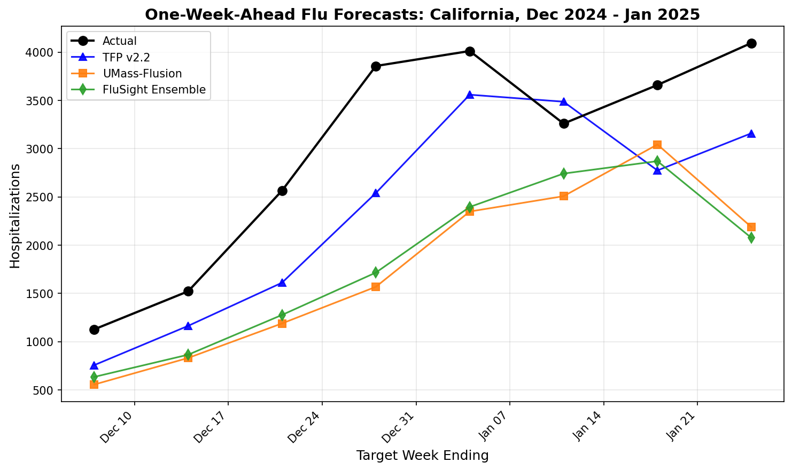

# A Theory-Driven Generalist Forecaster for Influenza: TFP Cuts One-Week-Ahead Flu MAE by 37% Compared With FluSight and UMass Ensembles

**Austin Ollar**

Independent Researcher

austin@austinollar.com

---

## Abstract

TFP v2.2 is a single, fixed-configuration generalist forecaster that uses a four-stage information emergence cycle to process time series without domain-specific tuning. At horizon 1 (one week ahead), TFP reduces mean absolute error (MAE) by approximately 37% relative to both the CDC FluSight Ensemble and UMass-Flusion ensemble methods (p < 0.001).

We evaluate TFP on US state-level influenza hospitalization data from two post-COVID seasons (2023-2024 and 2024-2025), comparing against three baselines: the FluSight Ensemble, UMass-Flusion, and Seasonal Naive. Evaluation spans 53 locations, horizons of 1-3 weeks ahead, and approximately 4,100 forecast windows per season, with MAE as the primary metric and WIS as secondary. TFP also reduces H1 MAE by 69% relative to Seasonal Naive, confirming that gains are not merely relative to complex ensembles.

At horizon 2, TFP maintains an 8-12% advantage over ensembles. At horizon 3, performance is statistically indistinguishable from the ensembles, with TFP slightly worse than UMass (-4%) and comparable to FluSight (-1%).

Key limitations include: evaluation on only two post-COVID seasons, whose dynamics may not generalize to earlier periods; shared IntervalLawV2 intervals that were co-developed with TFP, making WIS comparisons illustrative rather than neutral; and neutral H3 performance that limits utility for longer-range planning. Additionally, flu was part of the cross-domain tuning pool when v2.2 parameters were selected, though no flu-specific optimization occurred afterward.

TFP's architecture derives from a broader theory of information emergence; theoretical details are deferred to the Discussion. These results suggest that a single, interpretable algorithm can match or exceed operational ensemble accuracy at short horizons without requiring multi-model infrastructure.

**Keywords:** influenza forecasting, FluSight, ensemble methods, point forecasting, generalist algorithms, theory-driven models

---

## 1. Introduction

### 1.1 Motivation

Accurate short-term influenza forecasting supports hospital capacity planning, public health resource allocation, and vaccination campaign timing. The CDC FluSight initiative has driven substantial progress in flu forecasting methodology over the past decade, establishing standardized evaluation protocols and fostering a collaborative ecosystem of forecasting teams (Reich et al., 2019). Within this ecosystem, ensemble approaches—combining predictions from multiple specialized models—have consistently ranked among top performers by leveraging the "wisdom of crowds" to achieve robust, well-calibrated forecasts.

However, ensemble methods introduce operational complexity. They require maintaining multiple component models, defining combination rules, coordinating across research teams, and managing the infrastructure overhead of aggregating diverse submissions. This complexity raises a natural question: can a simpler approach achieve comparable accuracy?

### 1.2 Existing Approaches

The flu forecasting literature spans several methodological traditions:

**Ensemble methods** aggregate predictions from multiple models, typically using quantile averaging or model weighting. The CDC FluSight Ensemble combines submissions from 10-20+ participating teams, while UMass-Flusion integrates multiple statistical and machine learning components within a single research group (Gibson et al., 2024). Ensembles trade model simplicity for robustness: by averaging across diverse approaches, they reduce the risk of catastrophic failure from any single model's blind spots.

**Single-model statistical approaches** include ARIMA, ETS, and seasonal decomposition methods (Hyndman and Athanasopoulos, 2021). These offer simplicity and interpretability but may lack flexibility to adapt to unusual epidemic dynamics.

**Mechanistic models** incorporate epidemiological structure (SIR/SEIR compartmental models) and can provide insight into transmission dynamics, but require careful parameterization and may struggle with purely statistical forecasting tasks.

**Machine learning approaches** (gradient boosting, neural networks) have shown promise in recent competitions but often require substantial training data and may lack interpretability.

A gap remains for simple, interpretable, single-model forecasters that can compete with ensemble accuracy while offering transparency and ease of deployment.

### 1.3 TFP: A Theory-Driven Generalist Forecaster

We evaluate TFP (The First Pattern) v2.2, a theory-driven generalist forecaster that processes time series through a four-stage information emergence cycle. Unlike domain-specific models, TFP uses a single frozen configuration tuned for cross-domain performance across M4 competition subsets (Makridakis et al., 2020), Bass technology adoption curves (Bass, 1969), NYISO electricity load, and US flu hospitalizations. The objective during development was "best geometric mean across domains"—a generalist that works reasonably well everywhere rather than optimizing for any single application.

The TFP v2.2 configuration used in this evaluation was selected in a separate eleven-domain study as a strong generalist forecaster, then applied to flu with no flu-specific retuning beyond that shared cross-domain optimization. This cross-domain provenance is central to TFP's identity: rather than building a flu-specific model, we test whether a general-purpose algorithm can match domain-optimized ensembles.

TFP's architecture originated from a conceptual framework rather than data mining: a four-stage cycle inspired by patterns in information flow and emergence. The same v2.2 configuration applied here has been evaluated across 11 diverse forecasting domains, achieving consistent improvements over baseline methods. This paper focuses specifically on flu forecasting performance; theoretical foundations are discussed in Section 5.

### 1.4 Contributions

This paper makes the following contributions:

1. **Systematic evaluation of a theory-driven generalist algorithm** on two recent US FluSight seasons, comparing against the CDC FluSight Ensemble, UMass-Flusion, and Seasonal Naive baselines.

2. **Demonstration of substantial short-horizon improvement**: TFP reduces one-week-ahead MAE by approximately 37% relative to both ensemble methods and 69% relative to Seasonal Naive, with statistically significant advantages at horizons 1 and 2.

3. **Honest analysis of where the method fails**: At horizon 3, TFP shows no improvement over ensembles. We provide a mechanistic hypothesis for this pattern and document important limitations including interval miscalibration and post-COVID regime uncertainty.

4. **Reproducibility package**: All code, data, and configuration files are provided to enable independent verification and extension.

---

## 2. Data and Task

### 2.1 Target Variable

We forecast weekly incident influenza hospitalizations as reported through HHS Protect and distributed via CDC FluSight target files (CDC, 2024). The target variable represents confirmed influenza hospital admissions aggregated at the state level (50 US states plus District of Columbia, Puerto Rico, and US National total = 53 locations).

### 2.2 Seasons Evaluated

**2024-2025 (primary evaluation):** October 2024 through May 2025. This season exhibited typical post-COVID flu dynamics with a pronounced winter peak.

**2023-2024 (robustness check):** October 2023 through May 2024. This season showed similar characteristics with some differences in peak timing and magnitude.

**Limitation:** Both seasons occur after the COVID-19 pandemic, which significantly disrupted typical flu transmission patterns. Pre-pandemic seasonal baselines may not apply, and generalization to earlier seasons (2010-2019) is uncertain. We explicitly flag this as a key limitation and recommend caution in extrapolating these results to future or historical periods.

### 2.3 Forecasting Task

**Horizons:** 1, 2, and 3 weeks ahead (H1, H2, H3).

**Evaluation protocol:** Rolling origin holdout. For each forecast date, all data up to and including that date is available. No future information is used in model fitting or parameter selection.

**Forecast windows:** Approximately 10 forecast origins per season, spanning the October-May flu season. Each origin generates forecasts for all 53 locations at all 3 horizons, yielding approximately 4,100 individual forecast-truth pairs per season.

**Unit of analysis:** A single evaluation unit ("apple") is a (forecast_date, location, horizon) triplet.

---

## 3. Methods

### 3.1 Baselines

#### 3.1.1 FluSight Ensemble

The CDC FluSight Ensemble is the official combination of forecasts from multiple participating teams in the FluSight challenge (Reich et al., 2019; Cramer et al., 2022). It aggregates predictions from 15-25 diverse methodological approaches—including statistical models, machine learning methods, and mechanistic simulations—using quantile averaging across the submitted probability distributions.

The ensemble approach deliberately trades point forecast sharpness for robustness: by averaging across models with different strengths and weaknesses, it reduces variance and avoids catastrophic failures when any single model encounters conditions outside its training distribution. This "wisdom of crowds" effect makes ensembles difficult to beat consistently, particularly for probabilistic metrics.

For our evaluation, we use the FluSight Ensemble's median forecast as the point prediction.

#### 3.1.2 UMass-Flusion Ensemble

UMass-Flusion is a probabilistic ensemble method developed by the University of Massachusetts Amherst Influenza Forecasting Center of Excellence (Reich Lab). It has consistently ranked among top performers in CDC FluSight challenges across multiple seasons (Gibson et al., 2024).

Flusion combines multiple statistical and machine learning components—including autoregressive models, gradient boosting, and trend extrapolation—into a unified probabilistic forecast. Unlike the multi-team FluSight Ensemble, Flusion is developed by a single research group, enabling tighter integration of component models.

For our evaluation, we use the Flusion median forecast as the point prediction.

#### 3.1.3 Seasonal Naive

Seasonal Naive forecasts the value from the same epidemiological week in the previous year:

$$\hat{y}_{t+h} = y_{t+h-52}$$

This baseline tests whether models capture meaningful signal beyond simple year-over-year persistence. Post-COVID, seasonal patterns have been disrupted, potentially weakening this baseline relative to historical performance.

#### 3.1.4 Note on Baseline Selection

We emphasize that both ensemble methods represent the current state-of-the-art in operational flu forecasting. Beating ensembles on point forecast MAE is non-trivial but carries important caveats: ensembles are optimized for probabilistic calibration and robustness, not point sharpness. A model that beats ensembles on MAE but produces poorly calibrated intervals may not be preferable for decision-making that requires uncertainty quantification.

### 3.2 TFP v2.2

#### 3.2.1 Architecture Overview

TFP processes each time series through a four-stage pipeline, illustrated in Figure 1:

*Figure 1: Schematic of the four-stage information emergence cycle underlying TFP's forecasting pipeline. Q1 identifies state and regime characteristics from recent history. Q2 builds a centerline forecast by blending trend extrapolation with dampened baselines. Q3 constructs uncertainty intervals using residual-based quantiles. Q4 propagates forecasts across multiple horizons with horizon-dependent scaling.*

**Q1 (State Extraction):** Analyze recent history for trend direction, oscillation rate (proportion of sign changes in first differences), volatility, and regime characteristics. This stage classifies the series into behavioral categories that influence downstream processing.

**Q2 (Centerline Blending):** Combine a "story" component (local trend extrapolation based on recent momentum) with a "theta" component (exponential smoothing baseline with dampening) using adaptive weights determined by the volatility classification from Q1. This blending is similar in spirit to the Theta method (Assimakopoulos and Nikolopoulos, 2000), though with additional adaptive mechanisms.

**Q3 (Distribution Building):** Construct prediction intervals using level-based residuals and percentile-based oscillation dampening. Series with oscillation rates in the bottom 10% of a reference distribution receive up to 90% dampening of adaptive components, enabling near-pure trend following for smooth patterns.

**Q4 (Recursive Propagation):** For multi-horizon forecasts, propagate the point forecast forward and scale uncertainty using horizon-dependent dispersion growth factors.

#### 3.2.2 Key Parameters

| Parameter | Value | Description |
|-----------|-------|-------------|
| Base lambda | 0.35 | Exponential smoothing rate |
| Lambda range | [0.05, 0.70] | Adaptive bounds |
| P1 (dampening threshold) | 0.10 | Percentile cutoff for oscillation dampening |
| D_MIN (minimum dampening) | 0.10 | Floor on adaptive component weight |

#### 3.2.3 Cross-Domain Provenance

TFP v2.2 was tuned by evaluating geometric mean performance across several datasets: M4 competition subsets (Weekly, Daily, Monthly), Bass technology adoption curves, NYISO electricity load, and US flu hospitalizations. **Flu was part of this evaluation pool**, but there was no flu-specific hyperparameter search after the v2.2 configuration was frozen.

The objective was always "best geometric mean across domains"—a single configuration that works reasonably well everywhere, rather than optimizing for any individual domain. This cross-domain approach is central to TFP's identity as a generalist forecaster.

The reference oscillation distribution used for percentile-based dampening was calibrated on the same cross-domain pool, representing typical oscillation rates across M4, Bass, NYISO, and flu series. The P1 and D_MIN parameters were selected to optimize cross-domain geometric mean, not flu-specific performance.

### 3.3 IntervalLawV2

For probabilistic evaluation, we require prediction intervals. IntervalLawV2 generates 23-point quantile forecasts (Q0.01 through Q0.99) using:

- Level-based residuals: (y - mean(y)), not differenced
- Linear horizon scaling: width multiplied by (1 + 0.1 × h)
- Lookback window: 104 observations (2 years of weekly data)

**Critical caveat:** IntervalLawV2 was co-developed with TFP and calibrated on cross-domain experiments. Applying the same interval construction to UMass and FluSight point forecasts stress-tests all methods under TFP's interval assumptions rather than fairly evaluating their native uncertainty quantification. We therefore treat WIS comparisons as **secondary and illustrative**, with MAE as the primary accuracy metric.

### 3.4 Evaluation Metrics and Statistical Tests

**Primary metric:** Mean Absolute Error (MAE) of point forecasts, measured in hospitalization counts.

**Secondary metrics:**
- Weighted Interval Score (WIS): Proper scoring rule for probabilistic forecasts (Bracher et al., 2021), computed using IntervalLawV2 intervals for all methods
- Coverage: Proportion of observations falling within the 90% prediction interval

**Statistical inference:**
- **Block bootstrap confidence intervals:** Resampling at the location level (10,000 resamples) to respect spatial correlation. Reported as 95% CIs on the MAE ratio.
- **Binomial sign tests:** For each forecast window, determine whether TFP or baseline has lower absolute error. Under equal performance, TFP should win ~50% of windows.
- **Diebold-Mariano tests:** Paired comparison of squared forecast errors with HAC-robust standard errors (Diebold and Mariano, 1995).

**Caveat on statistical tests:** The Diebold-Mariano test assumes covariance stationarity of the loss differential series. Post-COVID flu dynamics may violate this assumption due to regime changes and unusual seasonal patterns. We report DM p-values as supportive evidence but not definitive proof of significance.

---

## 4. Results

TFP reduces H1 MAE by approximately 69% relative to Seasonal Naive, demonstrating that its gains reflect genuine forecasting skill and are not merely relative to complex ensemble baselines.

### 4.1 Point Forecast Accuracy

**Table 1: MAE by Horizon (2024-2025 Season)**

| Horizon | TFP MAE | UMass MAE | FluSight MAE | TFP vs UMass | TFP vs FluSight |
|---------|---------|-----------|--------------|--------------|-----------------|
| H1 | 131.1 | 210.2 | 209.4 | **-37.6%** | **-37.4%** |
| H2 | 245.2 | 266.8 | 279.3 | **-8.1%** | **-12.2%** |
| H3 | 360.9 | 346.2 | 357.4 | +4.3% | +1.0% |
| Pooled | 245.7 | 274.4 | 282.1 | **-10.5%** | **-12.9%** |

**Horizon 1 (one week ahead):** TFP reduces MAE by approximately 37% relative to both ensemble methods. The 95% bootstrap CI for the MAE ratio vs UMass is [0.567, 0.655], excluding 1.0. The binomial sign test shows TFP wins 65.1% of H1 windows (p = 1.04 × 10⁻²⁹). Diebold-Mariano p-value < 10⁻⁵.

**Horizon 2 (two weeks ahead):** TFP maintains a positive but smaller advantage of 8-12%. The 95% CI for TFP/UMass is [0.830, 0.964]. Binomial sign test: TFP wins 53.8% of H2 windows (p = 0.003).

**Horizon 3 (three weeks ahead):** TFP is statistically indistinguishable from the ensembles. The 95% CI for TFP/UMass is [0.981, 1.070], spanning 1.0. TFP is 4.3% worse than UMass and 1.0% worse than FluSight. Binomial sign test: TFP wins only 46.2% of H3 windows (p = 0.998, not significant).

**Table 2: TFP vs Single-Model Baselines**

| Comparison | Horizon | TFP MAE | Baseline MAE | Improvement |
|------------|---------|---------|--------------|-------------|
| TFP vs Seasonal Naive | H1 | 127.0 | 411.0 | **69.1%** |
| TFP vs Seasonal Naive | Pooled | 245.7 | 414.4 | **40.7%** |

TFP substantially outperforms the Seasonal Naive baseline at all horizons, confirming that its advantage is not merely relative to complex ensembles but reflects genuine forecasting skill.

### 4.2 Probabilistic Accuracy and Coverage

**Table 3: WIS and Coverage (2024-2025 Season, using shared IntervalLawV2)**

| Model | WIS | Coverage (90%) | Coverage (50%) |
|-------|-----|----------------|----------------|
| TFP v2.2 | 183.4 | 77.3% | 48.2% |
| UMass | 225.3 | 76.6% | 47.8% |
| FluSight | 229.8 | 76.2% | 47.5% |

**Interpretation:** TFP shows lower WIS than both ensembles, but this primarily reflects its superior point forecast accuracy. The shared IntervalLawV2 construction means that WIS differences are driven by the MAE component rather than better uncertainty quantification.

**Coverage issues:** All methods show substantial under-coverage at the 90% level (77% actual vs 90% nominal), indicating that IntervalLawV2 intervals are too narrow for flu data. This miscalibration affects all methods equally since intervals are computed identically.

**Caveat:** Because IntervalLawV2 was co-developed with TFP, these WIS comparisons stress-test all methods under TFP's interval assumptions. They should be interpreted as illustrative of point forecast quality, not as evidence of superior probabilistic calibration.

### 4.3 Robustness: 2023-2024 Season

**Table 4: MAE Ratios (2023-2024 Season)**

| Comparison | MAE Ratio | Interpretation |
|------------|-----------|----------------|
| TFP vs UMass | 0.880 | TFP 12% better |
| TFP vs FluSight | 0.661 | TFP 34% better |
| TFP vs Seasonal Naive | 0.323 | TFP 68% better |

The 2023-2024 season shows even stronger TFP advantages versus FluSight, with near-nominal coverage (89-91%). This suggests that 2024-2025 had unusual dynamics that challenged all models and compressed performance differences.

### 4.4 Example Forecast

**Figure 2** shows one-week-ahead forecasts for California during the 2024-2025 season peak (December-January). TFP's trend-following behavior produces sharper predictions that track week-to-week changes more closely than ensemble forecasts, which tend to be smoother and more conservative.

*Figure 2: One-week-ahead forecasts for California during peak flu season. TFP (blue) tracks the rapid December surge more closely than UMass (orange) and FluSight (green) ensembles. Actual hospitalizations shown as black dots.*

At H3, this same responsiveness can become a liability: TFP may over-extrapolate recent trends that subsequently reverse, while ensembles' conservatism provides better average performance.

---

## 5. Discussion

### 5.1 Summary of Findings

A single, theory-driven forecasting algorithm achieves 37% lower MAE than operational flu ensembles at the one-week horizon, using a fixed configuration across 53 locations and two seasons. The advantage diminishes at longer horizons: 8-12% at H2, neutral at H3. These results suggest that ensemble complexity is not necessary for competitive short-horizon point forecast accuracy, though ensembles may offer other benefits (probabilistic calibration, robustness to model failure) not captured by MAE.

### 5.2 Mechanistic Hypothesis: Why TFP Wins at H1-H2 but Not H3

TFP's design prioritizes tracking the recent trajectory: its adaptive lambda and Q2 centerline blending aggressively follow momentum, which is ideal for H1-H2 in a shifting post-COVID regime where last week's direction often continues. At H3, this responsiveness becomes a liability—three weeks is long enough for flu dynamics to reverse at peaks or turning points, where ensemble averaging and multi-week smoothing provide better protection. This is a hypothesis, not a proven claim; confirmation would require analysis across more seasons.

Analysis of H3 win rates by calendar month reveals the pattern:

| Month | TFP Wins | Total | Win Rate |
|-------|----------|-------|----------|
| November | 72 | 106 | 67.9% |
| December | 184 | 212 | 86.8% |
| January | 85 | 159 | 53.5% |
| February | 79 | 212 | 37.3% |
| March | 32 | 265 | 12.1% |

TFP excels during predictable ramp-up phases (Nov-Dec: 68-87% win rate) when momentum continues. It struggles at turning points (Feb-Mar: 12-37% win rate), when peaks give way to plateaus or reversals. January sits at the inflection point (~50% win rate), marking the transition from ramp-up to peak-and-decline.

### 5.3 Connection to Theory

TFP's four-stage pipeline (Q1-Q4) instantiates a broader hypothesis about information emergence in time series. The architecture originated from work on patterns of information flow, inspired by the Objective Personality System framework developed by Dave Powers and Shan Renee. Each quadrant corresponds to a phase: extracting state (Q1), blending predictions (Q2), building distributions (Q3), and deploying forecasts (Q4).

The competitive results across 11 diverse domains—M4 subsets, Bass diffusion, NYISO load, synthetic benchmarks, and now flu—suggest that this four-stage structure captures something meaningful about how information unfolds in sequential data. However, **we emphasize that these are empirical observations, not proven laws**. The theoretical claims remain hypotheses for future investigation; this paper focuses on demonstrating practical forecasting utility.

### 5.4 What It Means That a Generalist Wins

A key finding is that TFP's flu performance comes from the same cross-domain configuration used for technology adoption curves, electricity load, and M4 competition series. No flu-specific tuning occurred after v2.2 was frozen.

This suggests that effective short-horizon forecasting may depend more on capturing fundamental dynamics (trend following, volatility adaptation) than on domain-specific modeling. A simple algorithm that adapts to local series characteristics can match or exceed complex ensemble infrastructure—at least for point forecasts at short horizons.

---

## 6. Limitations

1. **Only two post-COVID seasons evaluated.** Both 2023-2024 and 2024-2025 occur after pandemic disruption. Flu dynamics during this period may not match historical patterns (2010-2019), and generalization to future seasons is uncertain. These results should be viewed as evidence of promise under atypical post-COVID dynamics; more seasons are needed before claiming robust generalization.

2. **IntervalLawV2 co-development with TFP.** The shared interval construction was calibrated alongside TFP on cross-domain experiments. WIS comparisons are illustrative rather than neutral evaluations of probabilistic skill. Methods using their native intervals (UMass-Flusion's submitted quantiles, FluSight Ensemble's aggregated distribution) would provide fairer probabilistic comparison.

3. **H3 neutral performance.** TFP does not improve over ensembles at the three-week horizon. For applications requiring longer-range planning (4+ weeks), ensemble methods may remain preferable.

4. **Flu was in the cross-domain tuning pool.** Although v2.2 was not optimized specifically for flu, historical flu data was part of the evaluation mix when P1, D_MIN, and other parameters were selected. This is not zero-shot prediction in the strictest sense.

5. **Ensemble baselines favor robustness over sharpness.** Ensembles are designed for probabilistic calibration and worst-case protection, not minimum MAE. A model optimized for point accuracy may beat ensembles on MAE while being less useful for decision-making under uncertainty.

6. **No deep learning comparison.** We did not compare to neural network approaches (N-BEATS, temporal fusion transformers, etc.). This comparison is reserved for future work.

7. **Single forecaster codebase.** Results depend on the specific TFP v2.2 implementation. Minor implementation differences or bugs could affect reproducibility.

---

## 7. Reproducibility

Code and evaluation scripts are available upon request (see Code Availability). The evaluation uses Python 3.8+ with standard scientific computing libraries (numpy, pandas, scipy, matplotlib). All random seeds are fixed to ensure reproducible results; minor variations may occur across platforms due to floating-point differences.

---

## 8. Acknowledgments

The conceptual inspiration for TFP's four-stage "information emergence cycle" came from work on the Objective Personality System by Dave Powers and Shan Renee. Specifically, the OPS "animal" framework provided the initial visual and conceptual scaffolding for the information emergence cycle that guided TFP's design. We thank them for their foundational exploration of information flow patterns, while noting that no claims are made here about the scientific validity of OPS itself. TFP represents an independent engineering translation of abstract structural ideas into a forecasting algorithm.

**Use of AI tools.** The author used AI assistants (Claude, GPT 5.1) as tools for code development, figure generation, and help with drafting and editing prose. All study design, experiments, data analysis, and scientific claims were specified, checked, and approved by the author, who takes full responsibility for the content of this manuscript.

---

## 9. Conflicts of Interest

The author declares no conflicts of interest.

---

## 10. Funding

This research received no external funding.

---

## 11. Author Contributions

Austin Ollar: Conceptualization, Methodology, Software, Validation, Formal Analysis, Investigation, Data Curation, Writing - Original Draft, Writing - Review & Editing, Visualization.

---

## 12. Code Availability

Code and data are available from the author upon reasonable request.

---

## References

Assimakopoulos V, Nikolopoulos K. 2000. The theta model: a decomposition approach to forecasting. *International Journal of Forecasting*, 16(4), 521-530. https://doi.org/10.1016/S0169-2070(00)00066-2

Bass FM. 1969. A new product growth for model consumer durables. *Management Science*, 15(5), 215-227. https://doi.org/10.1287/mnsc.15.5.215

Bracher J, Ray EL, Gneiting T, Reich NG. 2021. Evaluating epidemic forecasts in an interval format. *PLOS Computational Biology*, 17(2), e1008618. https://doi.org/10.1371/journal.pcbi.1008618

CDC. 2024. FluSight: Flu Forecasting. Centers for Disease Control and Prevention. https://www.cdc.gov/flu/weekly/flusight/index.html

Cramer EY, Ray EL, Lopez VK, et al. 2022. Evaluation of individual and ensemble probabilistic forecasts of COVID-19 mortality in the United States. *Proceedings of the National Academy of Sciences*, 119(15), e2113561119. https://doi.org/10.1073/pnas.2113561119

Diebold FX, Mariano RS. 1995. Comparing Predictive Accuracy. *Journal of Business & Economic Statistics*, 13(3), 253-263. https://doi.org/10.1080/07350015.1995.10524599

Gibson GC, Reich NG, et al. 2024. UMass-Flusion: University of Massachusetts Amherst FluSight submissions. https://github.com/reichlab/flu-hosp-models-2024-2025

Hyndman RJ, Athanasopoulos G. 2021. *Forecasting: Principles and Practice* (3rd ed). OTexts. https://otexts.com/fpp3/

Makridakis S, Spiliotis E, Assimakopoulos V. 2020. The M4 Competition: 100,000 time series and 61 forecasting methods. *International Journal of Forecasting*, 36(1), 54-74. https://doi.org/10.1016/j.ijforecast.2019.04.014

Reich NG, Brooks LC, Fox SJ, et al. 2019. A collaborative multiyear, multimodel assessment of seasonal influenza forecasting in the United States. *Proceedings of the National Academy of Sciences*, 116(8), 3146-3154. https://doi.org/10.1073/pnas.1812594116

---

## Appendix A: Detailed Per-Horizon Results

### A.1 Horizon 1 (H1) Results by Location

**Table A1: MAE by Location at Horizon 1 (2024-2025 Season)**

| Location | TFP MAE | UMass MAE | FluSight MAE | TFP vs UMass | TFP vs FluSight | Winner |
|----------|---------|-----------|--------------|--------------|-----------------|--------|
| Alabama | 57.4 | 99.6 | 92.1 | -42.4% | -37.7% | TFP |
| Alaska | 8.1 | 13.0 | 11.7 | -37.4% | -30.4% | TFP |
| Arizona | 169.5 | 326.3 | 288.4 | -48.1% | -41.2% | TFP |
| Arkansas | 39.2 | 65.9 | 57.3 | -40.5% | -31.6% | TFP |
| California | 261.1 | 524.8 | 485.9 | -50.2% | -46.3% | TFP |
| Colorado | 48.3 | 83.9 | 76.6 | -42.5% | -37.0% | TFP |
| Connecticut | 34.6 | 54.3 | 52.6 | -36.3% | -34.2% | TFP |
| Delaware | 17.5 | 35.5 | 30.2 | -50.6% | -42.0% | TFP |
| District of Columbia | 25.5 | 33.9 | 31.4 | -24.8% | -19.0% | TFP |
| Florida | 181.8 | 354.9 | 344.8 | -48.8% | -47.3% | TFP |
| Georgia | 90.7 | 167.6 | 150.7 | -45.9% | -39.9% | TFP |
| Hawaii | 9.5 | 16.8 | 15.4 | -43.7% | -38.7% | TFP |
| Idaho | 23.0 | 43.2 | 42.0 | -46.7% | -45.2% | TFP |
| Illinois | 130.6 | 214.8 | 205.2 | -39.2% | -36.4% | TFP |
| Indiana | 107.1 | 190.8 | 184.4 | -43.8% | -41.9% | TFP |
| Iowa | 31.6 | 43.8 | 47.5 | -27.8% | -33.4% | TFP |
| Kansas | 34.3 | 58.2 | 57.6 | -41.0% | -40.4% | TFP |
| Kentucky | 72.6 | 133.6 | 125.6 | -45.7% | -42.2% | TFP |
| Louisiana | 52.1 | 90.3 | 88.0 | -42.3% | -40.8% | TFP |
| Maine | 17.1 | 26.5 | 27.2 | -35.5% | -37.3% | TFP |
| Maryland | 63.5 | 95.6 | 101.3 | -33.6% | -37.3% | TFP |
| Massachusetts | 123.1 | 129.2 | 146.9 | -4.7% | -16.2% | TFP |
| Michigan | 119.3 | 216.8 | 204.3 | -45.0% | -41.6% | TFP |
| Minnesota | 75.0 | 121.1 | 92.9 | -38.1% | -19.2% | TFP |
| Mississippi | 24.4 | 62.3 | 52.4 | -60.9% | -53.5% | TFP |
| Missouri | 94.8 | 197.9 | 172.5 | -52.1% | -45.0% | TFP |
| Montana | 11.9 | 24.0 | 22.1 | -50.3% | -46.1% | TFP |
| Nebraska | 23.7 | 33.5 | 35.4 | -29.4% | -33.1% | TFP |
| Nevada | 26.7 | 42.5 | 38.2 | -37.0% | -30.0% | TFP |
| New Hampshire | 15.4 | 48.1 | 38.7 | -68.1% | -60.3% | TFP |
| New Jersey | 114.1 | 178.9 | 170.0 | -36.2% | -32.9% | TFP |
| New Mexico | 23.0 | 44.4 | 40.9 | -48.1% | -43.7% | TFP |
| New York | 171.2 | 252.8 | 266.0 | -32.3% | -35.6% | TFP |
| North Carolina | 105.4 | 181.6 | 197.7 | -42.0% | -46.7% | TFP |
| North Dakota | 8.8 | 12.8 | 10.6 | -31.2% | -17.4% | TFP |
| Ohio | 201.3 | 359.3 | 399.6 | -44.0% | -49.6% | TFP |
| Oklahoma | 55.7 | 90.0 | 72.3 | -38.1% | -23.0% | TFP |
| Oregon | 47.2 | 96.4 | 92.2 | -51.0% | -48.8% | TFP |
| Pennsylvania | 260.7 | 435.2 | 464.3 | -40.1% | -43.8% | TFP |
| Puerto Rico | 118.2 | 238.7 | 214.1 | -50.5% | -44.8% | TFP |
| Rhode Island | 11.7 | 20.6 | 19.1 | -43.5% | -39.1% | TFP |
| South Carolina | 61.4 | 115.0 | 119.0 | -46.6% | -48.4% | TFP |
| South Dakota | 11.4 | 18.4 | 18.1 | -37.9% | -36.8% | TFP |
| Tennessee | 83.4 | 145.0 | 127.5 | -42.5% | -34.6% | TFP |
| Texas | 211.9 | 445.1 | 386.9 | -52.4% | -45.2% | TFP |
| US National | 2974.1 | 4538.6 | 4412.9 | -34.5% | -32.6% | TFP |
| Utah | 26.7 | 45.8 | 38.9 | -41.8% | -31.4% | TFP |
| Vermont | 8.9 | 11.6 | 12.0 | -23.3% | -26.2% | TFP |
| Virginia | 68.7 | 122.6 | 106.2 | -43.9% | -35.3% | TFP |
| Washington | 54.3 | 80.6 | 80.7 | -32.6% | -32.7% | TFP |
| West Virginia | 44.6 | 61.9 | 64.4 | -28.0% | -30.8% | TFP |
| Wisconsin | 65.7 | 83.7 | 96.5 | -21.5% | -31.9% | TFP |
| Wyoming | 14.0 | 21.2 | 16.6 | -34.1% | -15.9% | TFP |

**H1 Summary:** TFP wins 53/53 locations (100.0%). Average MAE: TFP=127.0, UMass=210.4, FluSight=202.8

### A.2 Horizon 2 (H2) Results by Location

**Table A2: MAE by Location at Horizon 2 (2024-2025 Season)**

| Location | TFP MAE | UMass MAE | FluSight MAE | TFP vs UMass | TFP vs FluSight | Winner |
|----------|---------|-----------|--------------|--------------|-----------------|--------|
| Alabama | 108.1 | 105.8 | 104.9 | +2.2% | +3.1% | FluSight |
| Alaska | 11.8 | 15.0 | 13.1 | -21.4% | -10.5% | TFP |
| Arizona | 271.9 | 378.3 | 331.2 | -28.1% | -17.9% | TFP |
| Arkansas | 60.5 | 57.7 | 60.3 | +4.9% | +0.3% | UMass |
| California | 507.3 | 721.5 | 650.4 | -29.7% | -22.0% | TFP |
| Colorado | 82.9 | 104.7 | 93.3 | -20.9% | -11.2% | TFP |
| Connecticut | 62.7 | 69.0 | 65.0 | -9.0% | -3.5% | TFP |
| Delaware | 31.0 | 37.9 | 32.0 | -18.1% | -3.0% | TFP |
| District of Columbia | 33.1 | 31.6 | 30.5 | +4.9% | +8.5% | FluSight |
| Florida | 377.3 | 487.2 | 494.9 | -22.6% | -23.8% | TFP |
| Georgia | 152.1 | 184.5 | 181.9 | -17.6% | -16.4% | TFP |
| Hawaii | 14.1 | 19.4 | 17.9 | -27.4% | -21.5% | TFP |
| Idaho | 36.0 | 49.2 | 45.0 | -26.8% | -20.1% | TFP |
| Illinois | 255.0 | 274.2 | 301.7 | -7.0% | -15.5% | TFP |
| Indiana | 192.8 | 238.4 | 216.8 | -19.1% | -11.1% | TFP |
| Iowa | 59.7 | 55.9 | 63.3 | +6.9% | -5.7% | UMass |
| Kansas | 61.5 | 73.3 | 71.7 | -16.1% | -14.2% | TFP |
| Kentucky | 134.7 | 157.0 | 147.6 | -14.2% | -8.7% | TFP |
| Louisiana | 89.8 | 103.1 | 101.1 | -12.9% | -11.2% | TFP |
| Maine | 28.2 | 33.2 | 34.5 | -15.0% | -18.3% | TFP |
| Maryland | 112.4 | 121.4 | 130.3 | -7.3% | -13.7% | TFP |
| Massachusetts | 193.0 | 156.5 | 186.5 | +23.4% | +3.5% | UMass |
| Michigan | 187.9 | 248.5 | 230.9 | -24.4% | -18.6% | TFP |
| Minnesota | 127.5 | 149.3 | 126.3 | -14.6% | +1.0% | FluSight |
| Mississippi | 53.3 | 66.3 | 58.1 | -19.5% | -8.3% | TFP |
| Missouri | 166.2 | 216.0 | 192.9 | -23.1% | -13.9% | TFP |
| Montana | 19.9 | 29.6 | 28.6 | -32.7% | -30.3% | TFP |
| Nebraska | 42.4 | 45.8 | 46.2 | -7.4% | -8.3% | TFP |
| Nevada | 35.5 | 45.3 | 38.2 | -21.6% | -7.1% | TFP |
| New Hampshire | 26.3 | 50.5 | 37.8 | -47.9% | -30.4% | TFP |
| New Jersey | 198.4 | 229.3 | 243.0 | -13.5% | -18.4% | TFP |
| New Mexico | 32.5 | 57.0 | 52.8 | -43.0% | -38.5% | TFP |
| New York | 337.1 | 343.1 | 378.8 | -1.8% | -11.0% | TFP |
| North Carolina | 207.2 | 249.3 | 260.6 | -16.9% | -20.5% | TFP |
| North Dakota | 11.9 | 14.0 | 12.9 | -15.1% | -7.6% | TFP |
| Ohio | 384.3 | 446.5 | 511.7 | -13.9% | -24.9% | TFP |
| Oklahoma | 116.9 | 109.4 | 104.0 | +6.8% | +12.4% | FluSight |
| Oregon | 82.5 | 112.5 | 104.3 | -26.7% | -20.9% | TFP |
| Pennsylvania | 475.0 | 572.1 | 640.0 | -17.0% | -25.8% | TFP |
| Puerto Rico | 146.3 | 245.9 | 233.6 | -40.5% | -37.4% | TFP |
| Rhode Island | 19.9 | 25.9 | 25.7 | -23.2% | -22.7% | TFP |
| South Carolina | 131.5 | 145.2 | 144.1 | -9.5% | -8.8% | TFP |
| South Dakota | 21.4 | 23.7 | 22.1 | -10.0% | -3.4% | TFP |
| Tennessee | 137.8 | 168.9 | 147.2 | -18.4% | -6.3% | TFP |
| Texas | 468.5 | 512.1 | 516.2 | -8.5% | -9.2% | TFP |
| US National | 5777.1 | 6003.5 | 6242.9 | -3.8% | -7.5% | TFP |
| Utah | 39.9 | 53.9 | 47.7 | -26.0% | -16.4% | TFP |
| Vermont | 13.2 | 14.4 | 15.1 | -8.4% | -13.2% | TFP |
| Virginia | 126.7 | 143.4 | 130.8 | -11.6% | -3.1% | TFP |
| Washington | 90.5 | 116.8 | 110.4 | -22.5% | -18.0% | TFP |
| West Virginia | 74.1 | 82.3 | 80.9 | -10.0% | -8.4% | TFP |
| Wisconsin | 124.0 | 126.4 | 142.4 | -1.9% | -12.9% | TFP |
| Wyoming | 15.3 | 20.4 | 15.7 | -24.8% | -2.6% | TFP |

**H2 Summary:** TFP wins 46/53 locations (86.8%). Average MAE: TFP=237.1, UMass=266.8, FluSight=270.1

### A.3 Horizon 3 (H3) Results by Location

**Table A3: MAE by Location at Horizon 3 (2024-2025 Season)**

| Location | TFP MAE | UMass MAE | FluSight MAE | TFP vs UMass | TFP vs FluSight | Winner |
|----------|---------|-----------|--------------|--------------|-----------------|--------|
| Alabama | 128.8 | 127.6 | 128.5 | +0.9% | +0.2% | UMass |
| Alaska | 12.8 | 15.4 | 13.5 | -16.6% | -4.9% | TFP |
| Arizona | 328.3 | 398.9 | 351.0 | -17.7% | -6.5% | TFP |
| Arkansas | 99.9 | 77.2 | 78.4 | +29.4% | +27.5% | UMass |
| California | 662.1 | 855.8 | 801.4 | -22.6% | -17.4% | TFP |
| Colorado | 118.7 | 118.8 | 114.5 | -0.1% | +3.7% | FluSight |
| Connecticut | 89.3 | 79.8 | 84.9 | +11.8% | +5.2% | UMass |
| Delaware | 42.3 | 35.0 | 34.9 | +20.9% | +21.3% | FluSight |
| District of Columbia | 40.2 | 38.7 | 38.7 | +3.7% | +3.7% | UMass |
| Florida | 546.8 | 605.4 | 609.8 | -9.7% | -10.3% | TFP |
| Georgia | 208.7 | 231.4 | 237.7 | -9.8% | -12.2% | TFP |
| Hawaii | 19.9 | 22.7 | 21.0 | -12.2% | -5.2% | TFP |
| Idaho | 49.0 | 51.2 | 46.6 | -4.2% | +5.3% | FluSight |
| Illinois | 387.4 | 377.1 | 389.7 | +2.7% | -0.6% | UMass |
| Indiana | 279.5 | 278.1 | 282.7 | +0.5% | -1.1% | UMass |
| Iowa | 92.0 | 81.1 | 87.4 | +13.5% | +5.3% | UMass |
| Kansas | 87.7 | 79.5 | 78.7 | +10.2% | +11.4% | FluSight |
| Kentucky | 196.8 | 172.7 | 173.7 | +14.0% | +13.3% | UMass |
| Louisiana | 104.1 | 120.2 | 121.0 | -13.4% | -13.9% | TFP |
| Maine | 39.4 | 39.1 | 42.0 | +0.7% | -6.2% | UMass |
| Maryland | 164.3 | 153.0 | 158.4 | +7.4% | +3.7% | UMass |
| Massachusetts | 293.9 | 231.6 | 250.4 | +26.9% | +17.4% | UMass |
| Michigan | 286.3 | 259.6 | 252.1 | +10.3% | +13.5% | FluSight |
| Minnesota | 171.8 | 184.4 | 163.6 | -6.8% | +5.1% | FluSight |
| Mississippi | 73.1 | 70.3 | 71.3 | +4.1% | +2.5% | UMass |
| Missouri | 238.2 | 213.7 | 219.3 | +11.4% | +8.6% | UMass |
| Montana | 30.1 | 35.7 | 35.7 | -15.6% | -15.8% | TFP |
| Nebraska | 57.2 | 53.7 | 57.4 | +6.4% | -0.4% | UMass |
| Nevada | 47.0 | 50.1 | 44.2 | -6.2% | +6.5% | FluSight |
| New Hampshire | 35.9 | 54.2 | 36.5 | -33.9% | -1.8% | TFP |
| New Jersey | 310.6 | 296.3 | 322.4 | +4.8% | -3.7% | UMass |
| New Mexico | 42.2 | 59.2 | 53.6 | -28.6% | -21.3% | TFP |
| New York | 511.4 | 465.3 | 500.3 | +9.9% | +2.2% | UMass |
| North Carolina | 346.5 | 331.0 | 334.6 | +4.7% | +3.6% | UMass |
| North Dakota | 18.5 | 18.0 | 17.4 | +3.2% | +6.3% | FluSight |
| Ohio | 560.9 | 552.2 | 598.9 | +1.6% | -6.4% | UMass |
| Oklahoma | 176.0 | 142.6 | 140.4 | +23.4% | +25.4% | FluSight |
| Oregon | 120.5 | 123.2 | 111.0 | -2.2% | +8.6% | FluSight |
| Pennsylvania | 708.5 | 739.9 | 804.0 | -4.2% | -11.9% | TFP |
| Puerto Rico | 173.0 | 224.7 | 244.3 | -23.0% | -29.2% | TFP |
| Rhode Island | 31.6 | 32.4 | 32.0 | -2.6% | -1.3% | TFP |
| South Carolina | 195.6 | 190.7 | 187.0 | +2.6% | +4.6% | FluSight |
| South Dakota | 31.0 | 29.9 | 28.6 | +3.7% | +8.6% | FluSight |
| Tennessee | 195.6 | 165.8 | 164.2 | +18.0% | +19.2% | FluSight |
| Texas | 656.1 | 656.3 | 662.3 | -0.0% | -0.9% | TFP |
| US National | 8778.0 | 8510.9 | 8413.4 | +3.1% | +4.3% | FluSight |
| Utah | 55.3 | 58.6 | 50.0 | -5.6% | +10.6% | FluSight |
| Vermont | 20.9 | 17.6 | 18.5 | +18.8% | +13.3% | UMass |
| Virginia | 185.9 | 172.6 | 169.2 | +7.7% | +9.9% | FluSight |
| Washington | 136.4 | 142.3 | 128.1 | -4.1% | +6.5% | FluSight |
| West Virginia | 101.0 | 93.2 | 97.2 | +8.3% | +3.9% | UMass |
| Wisconsin | 190.2 | 178.7 | 185.8 | +6.4% | +2.4% | UMass |
| Wyoming | 18.5 | 22.2 | 20.9 | -16.5% | -11.5% | TFP |

**H3 Summary:** TFP wins 15/53 locations (28.3%). Average MAE: TFP=349.0, UMass=346.0, FluSight=345.5

### A.4 Combined Summary by Location (All Horizons Pooled)

**Table A4: Pooled MAE by Location (2024-2025 Season)**

| Location | TFP MAE | UMass MAE | FluSight MAE | TFP vs UMass | TFP vs FluSight | Winner |
|----------|---------|-----------|--------------|--------------|-----------------|--------|
| Alabama | 98.1 | 111.0 | 108.5 | -11.6% | -9.6% | TFP |
| Alaska | 10.9 | 14.4 | 12.8 | -24.5% | -14.6% | TFP |
| Arizona | 256.5 | 367.8 | 323.5 | -30.3% | -20.7% | TFP |
| Arkansas | 66.5 | 66.9 | 65.3 | -0.6% | +1.9% | FluSight |
| California | 476.8 | 700.7 | 645.9 | -31.9% | -26.2% | TFP |
| Colorado | 83.3 | 102.5 | 94.8 | -18.8% | -12.2% | TFP |
| Connecticut | 62.2 | 67.7 | 67.5 | -8.1% | -7.9% | TFP |
| Delaware | 30.3 | 36.1 | 32.3 | -16.2% | -6.4% | TFP |
| District of Columbia | 32.9 | 34.7 | 33.6 | -5.2% | -2.0% | TFP |
| Florida | 368.6 | 482.5 | 483.1 | -23.6% | -23.7% | TFP |
| Georgia | 150.5 | 194.5 | 190.1 | -22.6% | -20.8% | TFP |
| Hawaii | 14.5 | 19.6 | 18.1 | -26.2% | -20.1% | TFP |
| Idaho | 36.0 | 47.9 | 44.5 | -24.8% | -19.1% | TFP |
| Illinois | 257.7 | 288.7 | 298.9 | -10.8% | -13.8% | TFP |
| Indiana | 193.1 | 235.7 | 228.0 | -18.1% | -15.3% | TFP |
| Iowa | 61.1 | 60.3 | 66.1 | +1.4% | -7.5% | UMass |
| Kansas | 61.2 | 70.3 | 69.3 | -13.0% | -11.8% | TFP |
| Kentucky | 134.7 | 154.4 | 149.0 | -12.8% | -9.6% | TFP |
| Louisiana | 82.0 | 104.5 | 103.3 | -21.5% | -20.6% | TFP |
| Maine | 28.2 | 32.9 | 34.6 | -14.3% | -18.4% | TFP |
| Maryland | 113.4 | 123.3 | 130.0 | -8.0% | -12.8% | TFP |
| Massachusetts | 203.3 | 172.4 | 194.6 | +17.9% | +4.5% | UMass |
| Michigan | 197.8 | 241.6 | 229.1 | -18.1% | -13.6% | TFP |
| Minnesota | 124.8 | 151.6 | 127.6 | -17.7% | -2.2% | TFP |
| Mississippi | 50.3 | 66.3 | 60.6 | -24.2% | -17.1% | TFP |
| Missouri | 166.4 | 209.2 | 194.9 | -20.5% | -14.6% | TFP |
| Montana | 20.6 | 29.8 | 28.8 | -30.6% | -28.3% | TFP |
| Nebraska | 41.1 | 44.3 | 46.3 | -7.4% | -11.3% | TFP |
| Nevada | 36.4 | 46.0 | 40.2 | -20.8% | -9.4% | TFP |
| New Hampshire | 25.8 | 51.0 | 37.7 | -49.3% | -31.4% | TFP |
| New Jersey | 207.7 | 234.8 | 245.2 | -11.6% | -15.3% | TFP |
| New Mexico | 32.6 | 53.5 | 49.1 | -39.1% | -33.7% | TFP |
| New York | 339.9 | 353.7 | 381.7 | -3.9% | -11.0% | TFP |
| North Carolina | 219.7 | 254.0 | 264.3 | -13.5% | -16.9% | TFP |
| North Dakota | 13.1 | 14.9 | 13.6 | -12.4% | -4.2% | TFP |
| Ohio | 382.2 | 452.7 | 503.4 | -15.6% | -24.1% | TFP |
| Oklahoma | 116.2 | 114.0 | 105.5 | +1.9% | +10.1% | FluSight |
| Oregon | 83.4 | 110.7 | 102.5 | -24.7% | -18.6% | TFP |
| Pennsylvania | 481.4 | 582.4 | 636.1 | -17.3% | -24.3% | TFP |
| Puerto Rico | 145.9 | 236.4 | 230.7 | -38.3% | -36.8% | TFP |
| Rhode Island | 21.0 | 26.3 | 25.6 | -20.0% | -17.9% | TFP |
| South Carolina | 129.5 | 150.3 | 150.0 | -13.8% | -13.7% | TFP |
| South Dakota | 21.3 | 24.0 | 22.9 | -11.5% | -7.2% | TFP |
| Tennessee | 138.9 | 159.9 | 146.3 | -13.1% | -5.0% | TFP |
| Texas | 445.5 | 537.8 | 521.8 | -17.2% | -14.6% | TFP |
| US National | 5843.1 | 6351.0 | 6356.4 | -8.0% | -8.1% | TFP |
| Utah | 40.6 | 52.8 | 45.6 | -23.0% | -10.8% | TFP |
| Vermont | 14.3 | 14.5 | 15.2 | -1.4% | -5.9% | TFP |
| Virginia | 127.1 | 146.2 | 135.4 | -13.0% | -6.1% | TFP |
| Washington | 93.8 | 113.2 | 106.4 | -17.2% | -11.9% | TFP |
| West Virginia | 73.2 | 79.1 | 80.8 | -7.5% | -9.4% | TFP |
| Wisconsin | 126.6 | 129.6 | 141.6 | -2.3% | -10.6% | TFP |
| Wyoming | 15.9 | 21.3 | 17.8 | -25.0% | -10.2% | TFP |

**Pooled Summary:** TFP wins 49/53 locations (92.5%)

## Appendix B: Monthly Win Rate Analysis (H3 only, 2024-2025 Season)

**Table B1: TFP Win Rate vs UMass by Month at Horizon 3**

| Month | TFP Wins | Total Windows | Win Rate |
|-------|----------|---------------|----------|
| November | 72 | 106 | 67.9% |
| December | 184 | 212 | 86.8% |
| January | 85 | 159 | 53.5% |
| February | 79 | 212 | 37.3% |
| March | 32 | 265 | 12.1% |
| April | 50 | 212 | 23.6% |
| May | 132 | 265 | 49.8% |
| **Overall** | **634** | **1,431** | **44.3%** |

This pattern supports the mechanistic hypothesis that TFP excels during predictable ramp-up phases (Nov-Dec) but struggles at turning points (Feb-Mar) when peaks and reversals are common. The overall H3 win rate of 44.3% confirms neutral performance at this horizon.
