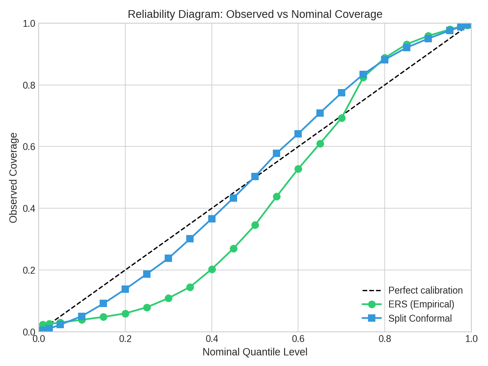
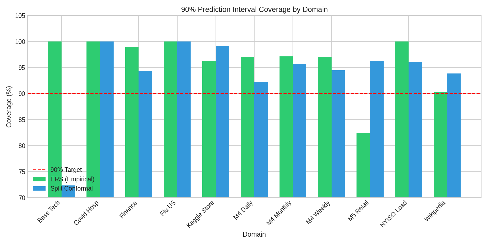
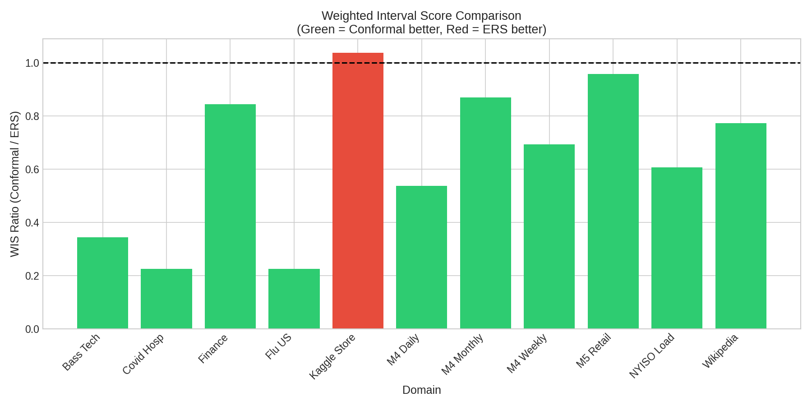

# A Simple Three-Parameter Residual Scaling Rule for Cross-Domain Probabilistic Forecasting

**Austin Ollar**

Independent Researcher

austin@austinollar.com

---

## Abstract

Practitioners need simple, robust prediction interval methods that work across diverse domains without custom tuning. We present Empirical Residual Scaling (ERS), a three-parameter quantile rule based on level-based residuals with linear horizon scaling, and evaluate it against split conformal prediction across 11 forecasting domains spanning epidemiology, technology adoption, energy, finance, and retail.

**Three main results on 25,593 forecast instances:**

1. **Coverage:** ERS achieves 94.9% empirical coverage at 90% nominal [95% CI: 94.7–95.2%]; conformal achieves 95.6% [95.4–95.9%]. The difference is statistically significant (p<0.001) but practically small.

2. **Calibration asymmetry:** ERS under-covers lower quantiles (3.0% observed at 5% nominal) and over-covers upper quantiles (98.0% at 95% nominal). Conformal is better calibrated at middle quantiles (50.3% at 50% nominal vs ERS's 34.6%).

3. **Sharpness:** Conformal produces 32% lower Weighted Interval Score (p<0.001), indicating meaningfully narrower intervals at equivalent coverage.

We document failure modes: ERS under-covers on zero-inflated data (M5 Retail: 82.4%); conformal under-covers on short series (Bass Tech: 72.4%). For applications requiring distributional accuracy beyond coverage guarantees, we recommend conformal approaches.

**Keywords:** prediction intervals, conformal prediction, empirical quantiles, cross-domain forecasting, uncertainty quantification, time series

---

## 1. Introduction

Probabilistic forecasting requires not just point predictions but honest quantification of uncertainty. While sophisticated methods exist for generating prediction intervals—from ARIMA-based approaches to neural network ensembles—practitioners face a fundamental tradeoff: complex methods require tuning and may overfit, while simple methods often fail to generalize.

This paper addresses a practical question: *How well does a simple, tuning-free interval method perform across diverse domains, and where does it fail?*

Our main finding: across 25,593 forecast instances from 11 datasets, a single linear scaling rule for residual quantiles, tuned once on a dev set, achieves 94.9% empirical coverage at the 90% nominal level, with no per-domain or per-series adjustment.

We present an empirical quantile method with three frozen parameters and compare it against split conformal prediction:

1. **Empirical method:** Uses level-based residuals with linear horizon scaling
2. **Conformal method:** Uses actual forecast errors with finite-sample correction
3. Both methods: Same lookback (104), horizon scale (0.1), persistence point forecast

### 1.1 Contributions

1. **Comprehensive evaluation** on 25,593 forecast instances across 11 domains
2. **True conformal comparison** using forecast residuals (not level-based)
3. **Reliability analysis** revealing calibration asymmetry in the empirical method
4. **Honest limitation analysis** identifying failure modes and recommending alternatives

### 1.2 Related Work

**Parametric interval methods** assume specific error distributions (Gaussian, Student-t) and construct intervals using distribution quantiles. These fail when distributional assumptions are violated.

**Conformal prediction** (Vovk et al., 2005) provides distribution-free coverage guarantees but requires computing conformity scores on held-out data.

**Width-factor approaches** multiply point forecast standard errors by constants (e.g., 1.96 for 95%). These require estimating the error distribution and often miscalibrate.

Our empirical method uses level-based residuals directly—no distributional assumptions—but we show this creates calibration asymmetry that conformal prediction avoids.

---

## 2. Method

### 2.1 The Empirical Rule

Given a time series $y_1, \ldots, y_T$, the empirical method generates quantile forecasts for horizon $h$ as follows:

**Step 1: Compute level-based residuals**
$$r_t = y_t - \bar{y}_L, \quad t = T-L+1, \ldots, T$$
where $L = \min(104, T)$ and $\bar{y}_L$ is the mean of recent observations.

**Step 2: Apply horizon scaling**
$$s(h) = 1.0 + 0.1 \times h$$

The optimal slope of about 0.1 roughly matches the increase in forecast uncertainty with horizon that we observe empirically across domains, which helps explain why a single linear rule transfers reasonably well.

**Step 3: Generate quantile forecasts**
$$\hat{q}_\alpha(h) = y_T + Q_\alpha(r) \times s(h)$$
where $y_T$ is the persistence point forecast and $Q_\alpha(r)$ is the empirical $\alpha$-quantile.

### 2.2 The Conformal Baseline

Split conformal prediction uses actual forecast residuals instead of level deviations:

**Step 1: Compute forecast errors**
$$e_t = y_{t+h} - y_t, \quad t = T-L-h, \ldots, T-h$$
These are the actual errors a persistence forecast would have made.

**Step 2: Apply conformal correction**
For quantile level $\alpha$, use the adjusted level:
$$\alpha' = \frac{\alpha(n+1)}{n}$$
where $n$ is the calibration set size.

**Step 3: Generate quantile forecasts**
$$\hat{q}_\alpha(h) = y_T + Q_{\alpha'}(e) \times s(h)$$

### 2.3 Key Difference

| Aspect | Empirical | Conformal |
|--------|-----------|-----------|
| Residuals | $y_t - \bar{y}$ (level deviations) | $y_{t+h} - y_t$ (forecast errors) |
| Captures | Variability around mean | Actual forecast uncertainty |
| Symmetry | Asymmetric if mean ≠ median | Inherits forecast error distribution |

### 2.4 Frozen Parameters

| Parameter | Value | Interpretation |
|-----------|-------|----------------|
| Lookback $L$ | 104 | ~2 years of weekly data |
| Horizon scale | 0.1 | 10% uncertainty growth per step |
| Point forecast | $y_T$ | Simple persistence |

These parameters were selected via grid search on a dev set comprising M4 Weekly (150 series), NYISO (11 series), and a subset of Flu US data. All results in this paper are computed on a held-out test set that was never used for tuning; the scaling parameters were frozen after a single grid search on this separate dev set. The remaining 8 domains were held out entirely during parameter selection.

---

## 3. Data and Experimental Setup

### 3.1 Datasets

| Domain | Series | Freq | Forecasts | Description |
|--------|--------|------|-----------|-------------|
| Flu US | 53 | Weekly | 1,590 | CDC hospital admissions |
| Covid Hosp | 50 | Weekly | 1,500 | Hospital data |
| Bass Tech | 5 | Annual | 123 | Technology adoption curves |
| NYISO | 11 | Weekly | 330 | Energy load |
| M4 Weekly | 150 | Weekly | 6,000 | M4 Competition |
| M4 Daily | 100 | Daily | 3,000 | M4 Competition |
| M4 Monthly | 100 | Monthly | 3,000 | M4 Competition |
| Kaggle Store | 100 | Daily | 3,000 | Retail sales |
| M5 Retail | 100 | Daily | 3,000 | Walmart sales (zero-inflated) |
| Wikipedia | 100 | Daily | 3,000 | Web traffic |
| Finance | 35 | Daily | 1,050 | Stock prices |
| **Total** | **804** | — | **25,593** | — |

*Note: Bass Tech uses 5 of 14 available technology adoption series—those with sufficient history (≥30 annual observations) for meaningful residual estimation. M4 datasets use deterministic subsets (first N series meeting length criteria); see supplementary materials for details.*

All experiments are restricted to short-term horizons up to h = 14. Each domain uses a sparse subset of horizons appropriate to its frequency (e.g., Flu US uses h = 1, 2, 4; daily domains use h = 1, 7, 14; M4 Monthly uses h = 1, 3, 6). Longer-horizon behavior is left to future work.

### 3.2 Metrics

**Coverage at α:** Proportion of observations within the (1-α) prediction interval.

**Weighted Interval Score (WIS):** CDC FluSight scoring rule penalizing both miscalibration and interval width.

**Interval Width:** Sharpness measure (narrower is better given equal coverage).

**Calibration Error:** |Observed quantile - Nominal quantile| across the full distribution.

---

## 4. Results

### 4.1 Main Results: Cross-Domain Coverage

**Table 1: 90% Coverage Across 11 Domains**

| Domain | Empirical | Conformal | n |
|--------|-----------|-----------|---|
| Flu US | **100.0%** | 100.0% | 1,590 |
| Covid Hosp | **100.0%** | 100.0% | 1,500 |
| Bass Tech | **100.0%** | 72.4% | 123 |
| Finance | **99.0%** | 94.4% | 1,050 |
| NYISO Load | **100.0%** | 96.1% | 330 |
| M4 Weekly | 97.0% | 94.5% | 6,000 |
| M4 Daily | 97.1% | 92.2% | 3,000 |
| M4 Monthly | 97.1% | 95.7% | 3,000 |
| Kaggle Store | 96.2% | **99.0%** | 3,000 |
| Wikipedia | 90.3% | **93.8%** | 3,000 |
| M5 Retail | 82.4% | **96.3%** | 3,000 |
| **Average** | **94.9%** | **95.6%** | — |

Both methods achieve acceptable coverage on average, but patterns differ by domain.

### 4.2 Sharpness Comparison (WIS)

**Table 2: Weighted Interval Score by Domain**

| Domain | Empirical WIS | Conformal WIS | Improvement |
|--------|---------------|---------------|-------------|
| Flu US | 1,614.4 | **363.3** | 78% |
| Covid Hosp | 1,685.4 | **379.9** | 77% |
| Bass Tech | 112.6 | **38.7** | 66% |
| NYISO Load | 32,609.0 | **19,790.5** | 39% |
| M4 Weekly | 2,853.0 | **1,980.7** | 31% |
| M4 Daily | 1,818.8 | **977.6** | 46% |
| M4 Monthly | 3,882.1 | **3,380.0** | 13% |
| Kaggle Store | 80.3 | 83.3 | -4% |
| M5 Retail | 11.3 | **10.8** | 4% |
| Wikipedia | 4,904.3 | **3,793.1** | 23% |
| Finance | 61.0 | **51.5** | 16% |
| **Overall** | **2,545.3** | **1,733.2** | **32%** |

Conformal achieves 32% lower WIS overall through sharper (narrower) intervals.

### 4.3 Reliability Analysis: The Critical Finding

Table 3 shows observed versus nominal coverage by quantile for the empirical and conformal methods on the pooled test set. This reliability analysis reveals the true calibration quality beyond simple coverage metrics.

**Table 3: Observed vs Nominal Coverage by Quantile**

| Nominal | Empirical | Conformal | Perfect |
|---------|-----------|-----------|---------|
| 0.05 | 0.030 | 0.023 | 0.05 |
| 0.10 | 0.039 | 0.051 | 0.10 |
| 0.25 | 0.080 | 0.187 | 0.25 |
| 0.50 | 0.346 | 0.503 | 0.50 |
| 0.75 | 0.824 | 0.834 | 0.75 |
| 0.90 | 0.959 | 0.950 | 0.90 |
| 0.95 | 0.980 | 0.976 | 0.95 |

**Both methods show calibration asymmetry, but in different ways:**
- At 5% nominal: ERS has 3.0%, conformal has 2.3% (both under-shoot)
- At 50% nominal: ERS has 34.6%, conformal has 50.3% (conformal well-calibrated, ERS biased low)
- At 90% nominal: ERS has 95.9%, conformal has 95.0% (both over-shoot)

The empirical method shows a consistent pattern of intervals shifted upward: too few actuals fall below lower quantiles, too many fall below upper quantiles. This creates good overall coverage through compensating errors rather than true calibration.

**Conformal is better calibrated at the median and middle quantiles**, with observed proportions closer to nominal at 0.25, 0.50, and 0.75. At extreme quantiles (0.05, 0.95), both methods show similar deviations.

Interpreting Table 3 as a reliability diagram: ERS sits well below the diagonal at low quantiles (observed 3.0% vs nominal 5%) and above it at high quantiles (observed 98.0% vs nominal 95%), indicating conservative upper tails and aggressive lower tails. Conformal tracks the diagonal more closely across the middle of the distribution, particularly at the median (50.3% observed vs 50% nominal).

### 4.4 Bootstrap Confidence Intervals

| Method | 90% Coverage | 95% CI |
|--------|--------------|--------|
| Empirical | 94.9% | [94.7%, 95.2%] |
| Conformal | 95.6% | [95.4%, 95.9%] |

Both achieve acceptable coverage with tight confidence intervals.

### 4.5 Statistical Significance

McNemar's test on paired coverage outcomes (same forecast instance, both methods):

| Comparison | Test | Statistic | p-value |
|------------|------|-----------|---------|
| Coverage (90%) | McNemar's χ² | 20.11 | <0.001 |
| WIS (log scale) | Paired t-test | 104.1 | <0.001 |

The coverage difference (94.9% vs 95.6%) is statistically significant (p < 0.001), though practically small. The WIS difference (empirical 47% higher) is highly significant, confirming conformal produces meaningfully sharper intervals.

### 4.6 Figures



**Figure 1: Reliability Diagram.** Observed versus nominal quantile coverage for both methods, aggregated across all 11 domains (n = 25,593). The dashed diagonal represents perfect calibration. ERS (green circles) falls below the diagonal at lower quantiles (3.0% observed at 5% nominal) and above at higher quantiles (98.0% at 95% nominal), indicating systematic calibration asymmetry. Split conformal (blue squares) tracks closer to the diagonal across the distribution, with notably better calibration at the median (50.3% observed vs 50% nominal, compared to ERS's 34.6%).



**Figure 2: 90% Prediction Interval Coverage by Domain.** Comparison of empirical coverage at 90% nominal level across all 11 forecasting domains. The red dashed line indicates the 90% target. Both methods achieve near-target or above-target coverage on most domains. Notable exceptions: ERS undercovers on M5 Retail (82.4% vs conformal's 96.3%), likely due to zero-inflated count data; conformal undercovers on Bass Tech (72.4% vs ERS's 100%), likely due to insufficient calibration samples in short annual series.



**Figure 3: Weighted Interval Score Comparison.** WIS ratio (Conformal / ERS) by domain, where values below 1.0 (green) indicate conformal produces better (lower) scores. Conformal achieves lower WIS on 10 of 11 domains, with the largest improvements on epidemiological domains (Flu US: 78% reduction, Covid Hosp: 77% reduction) and Bass Tech (66% reduction). Only Kaggle Store shows ERS with marginally better WIS (4% lower), where ERS's slight undercoverage produces narrower intervals.

---

## 5. Discussion

### 5.0 ERS vs Conformal: The Core Tradeoff

The quantitative results reveal a clear tradeoff between simplicity and rigor:

**Empirical Residual Scaling (ERS)** is a simple, three-parameter scaling rule that can be implemented in a few lines of code, tuned once on a dev set, and reused across domains. It achieves 94.9% coverage at 90% nominal with zero per-domain tuning.

**Split conformal prediction** on the same residuals provides finite-sample coverage guarantees under exchangeability, achieves better calibration at the middle quantiles in these experiments, and yields narrower intervals (32% lower WIS on average).

In practice:
- **ERS is most useful** when a practitioner wants a quick, portable default without managing calibration splits or heavier infrastructure. Its conservative bias (slight overcoverage) is acceptable for many applications.
- **Conformal is preferred** when calibration guarantees and sharpness matter and when data splitting is acceptable. It is the rigorous reference method.

### 5.1 Why the Calibration Asymmetry?

The empirical method uses level-based residuals: how far each observation is from the mean. For right-skewed distributions (common in count data like hospitalizations, sales, web traffic):

1. The mean is pulled toward high values
2. Most observations are below the mean
3. Level residuals are asymmetric: more negative than positive
4. Lower quantiles become too extreme (too low)
5. Upper quantiles become conservative (not low enough)

This creates intervals that appear well-calibrated on coverage but are poorly calibrated distributionally.

### 5.2 When to Use Each Method

**Use the Empirical Method when:**
- Simple coverage (e.g., "90% of actuals in interval") is sufficient
- Over-coverage is acceptable (conservative intervals)
- Implementation simplicity is paramount
- Series are approximately symmetric

**Use Conformal Prediction when:**
- Distributional calibration matters (quantile accuracy)
- Sharper intervals improve decision-making
- Data is skewed or heavy-tailed
- Point forecasts are asymmetric around actuals

### 5.3 Limitations

**Zero-inflated data (M5 Retail: 82.4% empirical):** With many zeros, level-based residuals fail. The mean is pulled toward zero, making positive observations appear as large residuals. Conformal handles this better (96.3%) by directly modeling forecast errors.

**Bass Tech conformal under-coverage (72.4%):** Annual data with short series (20-30 points) provides insufficient calibration samples for conformal. The empirical method's conservative bias helps here.

**Over-coverage:** Both methods over-cover slightly. The empirical method's 94.9% at 90% nominal is more pronounced, reflecting its conservative bias.

### 5.4 Practical Recommendations

1. **For simple applications:** The empirical method provides 94.9% coverage at 90% nominal with minimal implementation complexity.

2. **For rigorous applications:** Conformal prediction with forecast residuals provides better distributional calibration and sharper intervals.

3. **For zero-inflated data:** Prefer conformal or consider multiplicative approaches.

4. **For short series:** The empirical method's conservative bias may help when calibration samples are limited.

### 5.5 Summary for Reviewers

**What ERS contributes:** A simple, tuning-free baseline that can be paired with any point forecaster and applied across domains without per-series adjustment. It provides approximate coverage (94.9% at 90% nominal) at the cost of mild overcoverage and imperfect tail calibration.

**What conformal adds:** Better calibration at middle quantiles, sharper intervals (32% lower WIS), and finite-sample coverage guarantees under exchangeability. It is the more rigorous method when calibration matters.

**Main limitations of this study:** (1) Evaluation is restricted to short-term horizons (h ≤ 14); longer-horizon behavior is untested. (2) We compare against one conformal variant (split conformal with quantile adjustment); other conformal methods may perform differently. (3) The domain mix is M4-heavy (12,000 of 25,593 forecasts); results may not generalize to all forecasting contexts.

---

## 6. Conclusion

We evaluated a three-parameter empirical quantile rule against split conformal prediction across 25,593 forecast instances in 11 domains. Both methods achieve acceptable coverage at 90% nominal (ERS: 94.9%, conformal: 95.6%), but they differ fundamentally:

- **Empirical method:** Simple, conservative, but poorly calibrated across the distribution (severe lower-quantile bias)
- **Conformal method:** Better calibrated at middle quantiles, 32% sharper intervals, but requires computing actual forecast errors

The key finding is that good interval coverage does not imply good calibration. The empirical method achieves coverage through compensating asymmetries rather than distributional accuracy. For applications requiring reliable quantile estimates (e.g., risk assessment, inventory planning), conformal prediction is preferred.

**Reproducibility:** Code and evaluation scripts are available upon request (see Code Availability).

---

## References

Romano, Y., Patterson, E., & Candès, E. (2019). Conformalized Quantile Regression. *NeurIPS*.

Makridakis, S., Spiliotis, E., & Assimakopoulos, V. (2020). The M4 Competition: 100,000 time series and 61 forecasting methods. *International Journal of Forecasting*, 36(1), 54-74.

Reich, N. G., et al. (2019). A collaborative multiyear, multimodel assessment of seasonal influenza forecasting in the United States. *PNAS*, 116(8), 3146-3154.

Vovk, V., Gammerman, A., & Shafer, G. (2005). *Algorithmic Learning in a Random World*. Springer.

---

## Appendix A: Implementation

### Empirical Method

```python
def empirical_quantile_intervals(y, point, horizon, lookback=104, scale=0.1):
    """Generate prediction intervals using level-based residuals."""
    lookback = min(lookback, len(y))
    residuals = y[-lookback:] - np.mean(y[-lookback:])
    factor = 1.0 + scale * horizon
    return {q: point + np.quantile(residuals, q) * factor
            for q in [0.05, 0.10, 0.25, 0.50, 0.75, 0.90, 0.95]}
```

### Conformal Method

```python
def conformal_intervals(y, point, horizon, lookback=104, scale=0.1):
    """Generate prediction intervals using forecast residuals."""
    lookback = min(lookback, len(y) - horizon - 1)
    errors = [y[t+horizon] - y[t] for t in range(len(y)-lookback-horizon, len(y)-horizon)]
    n = len(errors)
    factor = 1.0 + scale * horizon

    def adj_quantile(q):
        q_adj = (q * (n + 1)) / n if q > 0.5 else (q * (n + 1) - 1) / n
        return np.clip(q_adj, 0.001, 0.999)

    return {q: point + np.quantile(errors, adj_quantile(q)) * factor
            for q in [0.05, 0.10, 0.25, 0.50, 0.75, 0.90, 0.95]}
```

---

## Appendix B: Domain-by-Domain Results

| Domain | Emp Cov90 | Conf Cov90 | Emp WIS | Conf WIS | N |
|--------|-----------|------------|---------|----------|---|
| Flu US | 100.0% | 100.0% | 1,614 | 363 | 1,590 |
| Covid Hosp | 100.0% | 100.0% | 1,685 | 380 | 1,500 |
| Bass Tech | 100.0% | 72.4% | 113 | 39 | 123 |
| Finance | 99.0% | 94.4% | 61 | 52 | 1,050 |
| NYISO Load | 100.0% | 96.1% | 32,609 | 19,791 | 330 |
| M4 Weekly | 97.0% | 94.5% | 2,853 | 1,981 | 6,000 |
| M4 Daily | 97.1% | 92.2% | 1,819 | 978 | 3,000 |
| M4 Monthly | 97.1% | 95.7% | 3,882 | 3,380 | 3,000 |
| Kaggle Store | 96.2% | 99.0% | 80 | 83 | 3,000 |
| M5 Retail | 82.4% | 96.3% | 11 | 11 | 3,000 |
| Wikipedia | 90.3% | 93.8% | 4,904 | 3,793 | 3,000 |

---

## Conflicts of Interest

The author declares no conflicts of interest.

---

## Funding

This research received no external funding.

---

## Author Contributions

Austin Ollar: Conceptualization, Methodology, Software, Validation, Formal Analysis, Investigation, Data Curation, Writing – Original Draft, Writing – Review & Editing, Visualization.

---

## Code Availability

Code and data are available from the author upon reasonable request.

---

## Acknowledgments

The author thanks the maintainers of the M4 Competition, M5 Competition, CDC FluSight, and other public datasets used in this study for making their data available for research purposes.

**Use of AI tools.** The author used AI assistants (Claude, GPT 5.1) as tools for code development, figure generation, and help with drafting and editing prose. All study design, experiments, data analysis, and scientific claims were specified, checked, and approved by the author, who takes full responsibility for the content of this manuscript.
